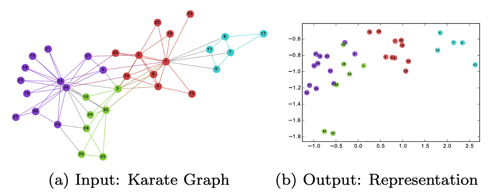

## 주제
- 추천 시스템

## 내용

### 트위터 추천 시스템
- 일론머스크에 의해 지난 2023년 트위터 추천 시스템의 소스코드가 공개되었다.

#### 기본적인 추천 시스템의 구성
1. Candidate Sourcing: 각각 다른 추천 소스에서 최고의 트윗을 가져오는 후보 소싱
2. Rank: 머신 러닝 모델을 통해 각 트윗 순위 메기기
3. Hueristic & Filter 적용: 차단한 사용자의 트윗, 선정적인 콘텐츠, 이미 본 트윗 필터링

#### Candidate Sourcing (후보 소싱)
- 여러 후보 소스들로부터 최선의, 그리고 관계성이 높은 트윗을 추출해서 1500개 추출
- In-Network 소스: 관련성이 높은 데이터
    - 팔로우하는 사용자들과 관련된 최신 트윗
    - 로지스틱 회귀 모델을 사용하여 팔로우하는 사람들의 트윗을 관련성에 따라 효율적으로 순위 매김
    - Real Group: 두 사용자 간의 참여율 예측 -> 더 높을수록 더 많은 트윗 제시
- Out-Network 소스: 사용자의 외부 네트워크에서의 연관 트윗
    - Social Graph: 팔로우하는 사람들이나 비슷한 관심사를 가진 사람들의 참여를 분석하기
        - 팔로우하는 사람들이 최근 참여한 트윗
        - 나와 비슷한 트윗들을 좋아하는 사람들이 좋아했던 다른 트윗
    - Embedding Spaces: 사용자들을 여러 커뮤니티 (임베딩 공간) 로 분리
        - 트위터에서는 SimClusters 사용, 이는 custom matrix factorization algorithm 사용
        - N주마다 업데이트, 사용자들와 트윗은 커뮤니티 공간으로 표현됨
        - 당연히 여러 커뮤니티에 포함될 수 있음
        - 커뮤니티 사용자들이 트윗을 좋아할수록 해당 트윗은 그 커뮤니티와 관련있게 됨

#### Rank
- 최대 약 1500개 정도의 트윗에 대하여 관련성 예측
    - 수천 개의 피처를 고려해 10개의 라벨을 output을 주어서, 각 트윗에 점수 부여
    - 각 라벨은 참여 확률을 나타냄, 이 스코어로 순위 매기기

#### Heuristic & Filter
- 차단한 사용자 보이지 않게 하기 (Visibility 필터링)
- 같은 사람이 쓴 연속적인 트윗은 피하도록 하기 (Author Diversity)
- In-Network와 Out-Network가 적당히 균형있게 전달되도록 하기 (Balance)

#### Mixing
- 실제로는, 트윗과 non-트윗(광고나 팔로우 추천 등) 콘텐츠를 섞어서 나타나도록 디스플레이
- 하루에 50억번 실행되며, 평균 1.5초 이하로 완료된다고 함
- 단일 파이프라인 실행에는 CPU 시간으로 220초 정도 걸린다고 함

### 그래프 임베딩
- 그래프를 벡터나 벡터 집합으로 변환해주는 것

- 왼쪽의 그래프의 꼭짓점을 오른쪽에 있는 2차원 벡터들로 변환할 수 있음
- 임베딩의 결과는 그래프의 구조, 꼭짓점 간의 관계, 꼭짓점이나 부분 그래프와 연관된 다른 기타 부가 정보들을 나타낼 수 있어야 함
    - 꼭짓점 임베딩: 각 꼭짓점을 벡터로 표현. 그래프 하나를 평면에 시각화하거나, 새로운 연결 예측(페이스북 친구 추천처럼)에 사용
    - 그래프 임베딩: 그래프 전체를 벡터로 표현
- 즉, 대규모 네트워크의 노드를 컴팩트한 저차원 표현으로 변환하는 데 사용하게 된다
- DeepWalk, node2vec, SDNE는 꼭짓점 임베딩 기법 / Graph2vec는 그래프 임베딩 기법

#### 트위터의 SimClusters
- 각 차원은 유사한 팔로워들의 클러스터인 커뮤니티로 표현됨
1. Follow 그래프 생성: 팔로워-팔로위 행렬 만듦
2. 생산자-생산자 행렬 생성: Follow 그래프에서 생산자-생산자 행렬을 만들어서, 팔로워 집합이 얼마나 겹치는지가 코사인 유사도가 되도록 함
3. KnownFor 행렬 생성: Follow 그래프를 k개의 커뮤니티로 나눠 밀도 높여 생성, 생산자-생산자 행렬의 저차원 표현이 된다
4. 사용자 임베딩 계산: Follow 그래프에 KnownFor 행렬을 곱해 사용자 임베딩 계산 (사용자 InterestedIn 임베딩)
5. 아이템 임베딩 계산: 트윗에 반응을 한 사용자들의 InterestedIn 벡터를 집계해 계산

## 참고 문헌
<!-- 참고한 자료의 제목과 링크를 작성해주세요 -->
1. twitter, "the algorithm ml", Github Source code for Twitter's Recommendation Algorithm, https://github.com/twitter/the-algorithm-ml
2. 오수은, "트위터 추천 알고리즘 오픈소스화 / Github 공개", https://sooeun67.github.io/data%20science/twitter-opensourced/
3. snooby, "Graph Embedding", https://velog.io/@baeyuna97/Graph-Embedding