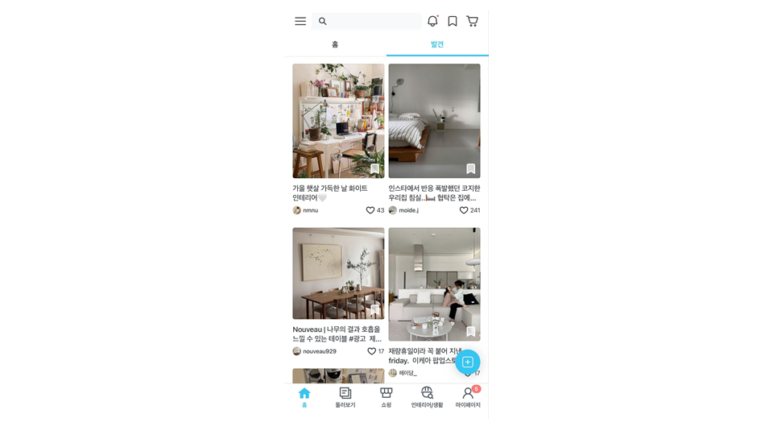
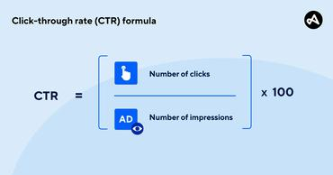
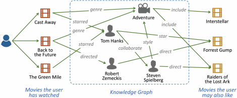

 
## 주제

1. 실제 대형 서비스에 접목되는 추천 시스템 사례
2. 그래프 기반 추천 시스템의 이해
  
## 내용

오늘의 집에서는 유저의 관심사를 파악하고 그 관심사에 맞는 피드를 전달하기 위해 개인화 알고리즘을 이용한 콘텐츠 추천을 제공하고 있습니다.

  유저의 선호도를 "유저가 콘텐츠를 클릭할 확률"로 정의하고 "클릭할 확률"을 예측하여 이것으로 순위를 매기는 랭킹 모델을 개발하는 것인데요, 이렇게 새로운 item에 대한 click 확률을 예측하는 문제를 Click-through rate(CTR) prediction이라고 합니다.

해당 사례의 경우, Logistic Regression을 포함한 여러 모델을 테스트하여 유저의 실제 선호도와 일치하는지 확인하는 방식으로 FwFM 모델을 최종 선택하여 이용하고 있습니다.

출처: https://www.bucketplace.com/post/2024-07-10-%EA%B0%9C%EC%9D%B8%ED%99%94-%EC%B6%94%EC%B2%9C-%EC%8B%9C%EC%8A%A4%ED%85%9C-2-personalized-content-ranking/

---

2. 그래프 기반 추천 시스템의 이해
	전통적인 협업 필터링은 대부분의 유저가 일부 아이템에 대해서만 평가를 수행하는 **희소성 문제**나 신규 이용자나 아이템에 대한 추천을 만들어내기 어려운 **콜드 스타트**와 같은 한계점을 갖고 있었습니다.

	

	그래프 기반 추천 시스템은 이러한 한계를 해결하기 위해 등장한 기법입니다. 사용자와 아이템을 노드(Node)로, 서로 간의 관계를 엣지(Edge)로 표현하여 더 복잡한 관계에 대한 학습이 가능해집니다. 대표적인 그래프 신경망을 기반으로 하고 있는 추천 시스템은 다음과 같습니다.

   - **GCN (Graph Convolutional Network)** : 그래프 구조에서 CNN을 적용하여 노드 간 정보를 학습

    - **GraphSAGE** : 샘플링 기반으로 대규모 그래프에서도 학습 가능
  
    - **PinSage** (Pinterest 추천 모델) : GraphSAGE를 Pinterest의 추천 시스템에 적용한 모델

    - **LightGCN** : 단순화된 GCN 구조로 추천 성능을 높임
