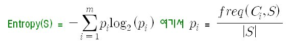

## 주제
<!-- 이번 주차에 다룬 주요 주제를 작성해주세요 --> 
1. 정보이득
2. 오토인코더


### 🔹 **1. 정보이득(Information Gain)**
- 정보이득(IG): **데이터의 불확실성(엔트로피)이 특정 속성을 기준으로 얼마나 줄어드는지**를 측정하는 지표  
    - 즉, 특정 특성(feature)으로 데이터를 분할했을 때, 이전보다 얼마나 더 "순수한"(pure) 상태가 되었는지**를 수치적으로 표현한 값
- 의사결정 트리 목표: 데이터를 **최대한 구분이 잘되는 방향으로 분할**
    - 각 특성(Feature)에 대해 정보이득을 계산하고, 가장 높은 정보이득을 주는 특성을 기준으로 데이터를 나눔 


#### 정보이득 수식
- IG(S, A) = H(S) - H(S | A)
    - IG(S, A) = 속성 A를 기준으로 데이터를 나눌 때 얻는 정보이득  
    - H(S) = 원래 데이터 집합 S의 엔트로피  
    - H(S|A) = 속성 A를 기준으로 분할한 후의 조건부 엔트로피


#### 엔트로피(Entropy)
- 엔트로피는 데이터의 혼잡도(불순도)를 측정하는 척도
    - 엔트로피가 낮을수록 데이터가 더 순수하고, 높을수록 더 혼합


 
- C: 클래스 값들의 집합
- S: 주어진 데이터들의 집합 개수  
- freq(C_i, S): S에서 C_i에 속하는 클래스들의 수 

    
    **엔트로피 예제**  
- 만약 모든 샘플이 하나의 클래스라면: H(S) = 0  (완전히 순수한 데이터)  
    -  10명 모두 일반회원이거나 10명 모두 우수회원이라면 데이터가 혼합되어있지 않으므로 엔트로피 값은 0이 된다.

- 만약 클래스가 균등하게 섞여 있다면: H(S) = 1 (최대 불확실성) 
    - 10명의 회원 중 5명이 우수회원, 5명이 일반회원이라고하면 데이터가 완전히 혼합되어 있으므로 엔트로피 값은 1이된다.

#### 정보이득 계산 과정
1. **전체 데이터의 엔트로피** H(S) 계산
2. **각 속성(Feature)별로 데이터를 나누고, 조건부 엔트로피 H(S | A) 계산**
3. 정보이득 IG(S, A) = H(S) - H(S | A) 구하기
4. 가장 높은 정보이득을 주는 속성을 기준으로 데이터를 분할

##### 예제


#### 정보이득이 높은 속성 선택
의사결정 트리는 **정보이득이 가장 높은 속성을 루트 노드로 선택**하고, 반복적으로 각 노드에서 동일한 방식으로 서브트리를 생성


#### 정보이득의 한계점
1. **편향적인 선택**  
   - 정보이득은 **클래스 개수가 많거나 속성 값이 많은 경우 편향**될 수 있음.  
   - 예를 들어, 고유한 값이 많은 속성(예: ID, 전화번호)은 거의 모든 샘플을 구분할 수 있지만, 일반화되지 않음.
  
2. **균형 잡힌 데이터에 더 적합**  
   - 데이터가 심하게 불균형하면 정보이득이 왜곡될 수 있음.

3. **대체 지표: 지니 계수(Gini Index) & 정보이득비율(Information Gain Ratio)**  
   - 지니 계수는 불순도를 측정하는 또 다른 방법으로, CART(Classification and Regression Tree) 알고리즘에서 사용  
   - 정보이득비율은 정보이득을 정규화하여 값이 많은 속성의 문제를 보완


#### 정보이득과 의사결정 트리 알고리즘
정보이득을 활용하는 대표적인 의사결정 트리 알고리즘:
- **ID3**: 정보이득(IG) 기반 분할
- **C4.5**: 정보이득비율(IGR) 사용하여 ID3 개선
- **CART**: 지니 계수(Gini Index) 사용

### 정리
✅ **정보이득(IG)** : 데이터를 특정 속성 기준으로 나눌 때 줄어드는 엔트로피  
✅ 높은 정보이득을 가진 속성을 기준으로 트리를 분할 
✅ 엔트로피를 이용하여 정보이득을 계산
✅ 정보이득이 너무 높은 경우, 과적합(overfitting) 가능성 
✅ 대체 방법: 지니 계수(Gini Index), 정보이득비율(IGR)  


## 추가자료

위의 그래프를 보면 정보이득(Information Gain)의 개념을 직관적으로 이해할 수 있습니다.

1️⃣ 첫 번째 그래프 (Before Split)

원래 데이터는 Class 0과 Class 1이 섞여 있어 엔트로피가 높음 (혼합된 상태).
즉, 불확실성이 크고, 분할해야 할 필요성이 있음.

2️⃣ 두 번째 및 세 번째 그래프 (After Split)

데이터를 특정 기준으로 나누었더니, 각 그룹이 더 순수해짐.
첫 번째 그룹(왼쪽)은 거의 Class 0으로 이루어짐.
두 번째 그룹(오른쪽)은 Class 1이 더 많음.
- 결과적으로 엔트로피가 감소하여 정보이득(IG)이 증가함.
즉, 데이터를 잘 나눌수록 정보이득이 커지고, 불확실성이 줄어듦

----


### 🔹 **2. 오토인코더(Autoencoder)**
- 작동원리 소개
- 구조
- 컴퓨터 비전에서 필수인 이유
- 한계점 및 해결책

#### **오토인코더(Autoencoder)란?**  
오토인코더(AE, Autoencoder)는 입력 데이터를 압축(Encoding)하고 다시 복원(Decoding)하는 신경망 구조  
- 비지도 학습(unsupervised learning) 방식으로 학습  
- 데이터의 핵심 특징(feature)만을 추출하여 표현  
- 주로 차원 축소(Dimensionality Reduction), 이상 탐지(Anomaly Detection), 이미지 복원(Image Denoising) 등에 사용  


#### 오토인코더의 구조
- **세 가지 주요 부분**으로 구성

#### **1️⃣ 인코더(Encoder)**  
- 입력 데이터를 저차원의 잠재 공간(Latent Space)으로 변환 (압축)
- 중요한 특징(feature)만 남기고 불필요한 정보 제거  
- 수식:  
  \[
  z = f(Wx + b)
  \]
  (여기서 x는 입력, z는 압축된 표현)  

#### **2️⃣ 잠재 공간(Latent Space, Bottleneck Layer)**  
- 인코딩된 벡터를 저장하는 공간  
- 차원이 원본 데이터보다 작음 (예: 784 → 32 차원)  

#### **3️⃣ 디코더(Decoder)**  
- 압축된 데이터를 다시 원래 데이터 형태로 복원  
- 수식:  
  \[
  x' = g(W'z + b')
  \]
  (여기서  x'는 복원된 출력)  


📌 **손실 함수 (재구성 오차, Reconstruction Loss):**  


입력 x와 복원된 x'의 차이를 최소화하도록 학습  

#### 오토인코더의 학습 과정  
1. 입력 데이터 x를 인코더에 통과시켜 압축된 표현 z를 얻음.  
2. 압축된 표현 z를 디코더를 통해 다시 복원된 데이터로 변환.  
3. 원본 데이터 x와 복원된 데이터 x'사이의 차이를 최소화하는 방향으로 학습.

#### 오토인코더의 종류

| 오토인코더 종류  | 특징 및 사용 예시  |
|---------------|------------------------------------------------------|
| **기본 오토인코더 (Vanilla AE)**  | 가장 기본적인 구조 (MLP 사용), 특징 추출 및 차원 축소 |
| **변분 오토인코더 (VAE, Variational Autoencoder)**  | 확률적(latent) 공간을 활용하여 데이터 생성 가능 (GAN과 유사) |
| **스파스 오토인코더 (Sparse Autoencoder)**  | 희소성(Sparsity) 적용 → 이상 탐지 및 특징 선택에 유리 |
| **딥 오토인코더 (Deep Autoencoder)**  | 인코더 & 디코더를 다층 신경망으로 구성하여 성능 향상 |
| **컨볼루션 오토인코더 (CAE, Convolutional Autoencoder)**  | CNN을 활용하여 이미지 데이터를 효율적으로 압축 및 복원 |


#### 오토인코더는 왜 컴퓨터 비전에서 필수적인가?
오토인코더는 **컴퓨터 비전(Computer Vision, CV)에서 강력한 도구**로 활용  

**✅ 1. 데이터 차원 축소 (Dimensionality Reduction)**  
- 이미지 데이터는 픽셀 단위로 고차원 데이터임.  
- 오토인코더를 활용하면 중요한 특징만 남기고 압축하여 연산량을 줄이고 속도를 높일 수 있음.  
    - 예시: 256×256 RGB 이미지를 100차원의 벡터로 변환 가능.  

**✅ 2. 노이즈 제거 (Denoising Autoencoder, DAE)**  
- 이미지에서 불필요한 노이즈를 제거하는 데 사용됨.  
- 예: 저해상도 또는 흐린 이미지를 선명하게 복원.  
- 실제 사용 사례: 의료 영상, 감시 카메라 영상 개선  

**✅ 3. 이상 탐지 (Anomaly Detection)**  
- 정상적인 데이터 패턴을 학습한 후, 비정상적인 데이터(이상치)를 탐지할 수 있음.  
- 예: 의료 영상 분석(CT, MRI), 제조 공정에서 결함 탐지

**✅ 4. 이미지 생성 및 보완 (Image Generation & Completion)**  
- 변분 오토인코더(VAE)를 활용하면 새로운 이미지를 생성할 수 있음.  
- 특정 부분이 손상된 이미지를 자동으로 복원하는 기능 가능.  

**✅ 5. 특징 학습 (Feature Learning)**  
- 컴퓨터 비전에서는 이미지에서 중요한 특징(feature)을 추출하는 것이 중요함.  
- 오토인코더는 CNN보다 더 추상적이고 유용한 특징을 학*할 수 있음.  

#### **오토인코더의 한계점 및 해결책**  

| 한계점  | 해결책  |
|------|------------------------------------------------------|
| **생성된 이미지 품질 저하**  | 변분 오토인코더(VAE), GAN과 결합하여 개선 가능 |
| **데이터 재구성 능력의 한계**  | 컨볼루션 오토인코더(CAE) 사용하여 공간 정보 보존 |
| **일반화 문제**  | 정규화(Regularization), 데이터 증강(Data Augmentation) 적용 |

#### **오토인코더의 작동을 그래프로 이해하기**
아래는 오토인코더의 구조를 개념적으로 나타낸 다이어그램입니다.

```
[ Input Layer ] → [ Encoder ] → [ Bottleneck (Latent Space) ] → [ Decoder ] → [ Output Layer ]
```
- **입력(Input Layer)**: 원본 이미지 (예: 28×28 MNIST 숫자)
- **인코더(Encoder)**: 뉴런 수를 점점 줄이며 데이터를 압축
- **잠재 공간(Latent Space, Bottleneck)**: 가장 중요한 정보만 남김
- **디코더(Decoder)**: 다시 원본 크기로 복원
- **출력(Output Layer)**: 원본 이미지와 유사한 복원된 이미지

-----
