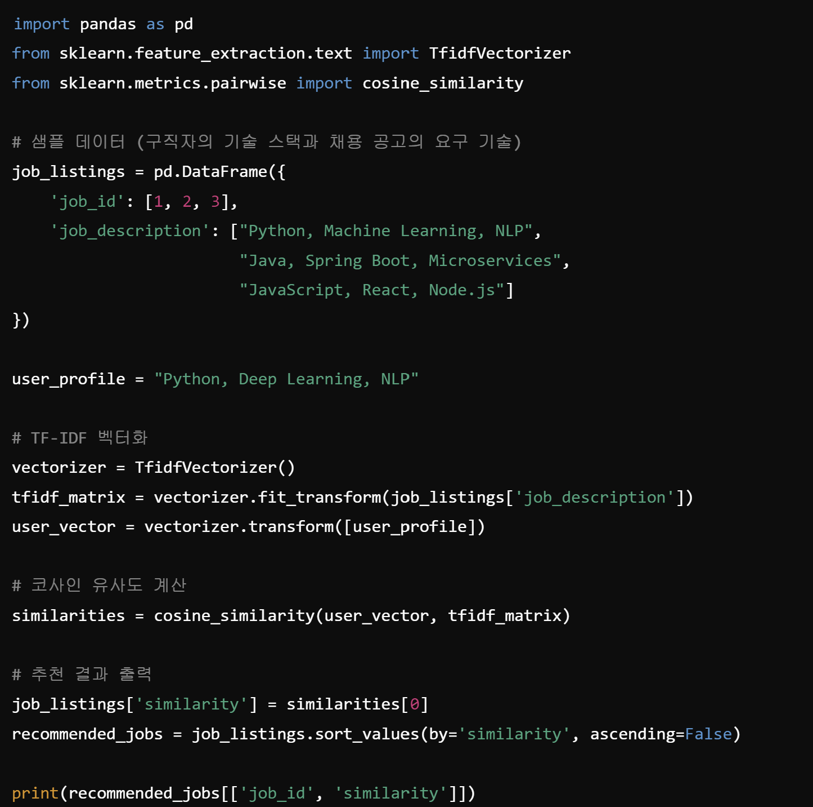

## 주제
<!-- 이번 주차에 다룬 주요 주제를 작성해주세요 --> 
1. 추천시스템(대표적인 사례 포함)

### **1. 추천시스템**
- 추천시스템: 사용자의 선호도를 분석하여 맞춤형 콘텐츠, 제품, 서비스 등을 추천하는 시스템
    
    ㄴ 머신러닝, 데이터 마이닝, 통계 기법 활용
- 대표적인 방식
    - **콘텐츠 기반 필터링**: 사용자가 과거에 좋아한 항목(영화, 책, 상품 등)의 특징을 분석하여 유사한 항목을 추천하는 방식
        - 예: 영화 추천 시스템이 사용자가 본 영화의 장르, 감독, 배우 정보를 바탕으로 비슷한 영화 추천
        - 원리
            1. 아이템(상품, 영화 등)의 속성(feature) 벡터화
            2. 사용자가 선호한 아이템과 유사한 속성을 가진 아이템 추천
            3. TF-IDF, 코사인 유사도, 벡터 내적 등을 활용
        - 장점
            - 사용자의 개별 취향을 반영
            - 새로운 사용자가 적응할 시간이 짧음
        - 단점
            - 새로운 콘텐츠(아이템)에 대한 추천이 어려움 (콜드 스타트 문제)
            - 사용자의 기존 취향에서 벗어난 새로운 추천이 어려움

    - **협업 필터링**: 비슷한 취향을 가진 사용자끼리 정보를 공유하여 추천하는 방식
        - 종류
            - 사용자 기반 협업 필터링 (User-Based CF):
나와 비슷한 취향을 가진 다른 사용자가 좋아한 아이템을 추천
(ex. 내가 좋아하는 영화와 유사한 영화를 좋아하는 다른 사용자가 본 영화를 추천)
            - 아이템 기반 협업 필터링 (Item-Based CF):
사용자가 특정 아이템을 좋아하면, 해당 아이템과 유사한 아이템을 추천(ex. A 영화와 B 영화를 좋아하는 사용자가 많다면, A를 본 사용자에게 B를 추천)
        - 원리
            1. 사용자-아이템 행렬 생성 (사용자가 특정 아이템을 평가한 데이터)
            2. 유사도 계산 (코사인 유사도, 피어슨 상관계수 등)
            3. 유사한 사용자/아이템을 기반으로 추천 생성
        - 장점
            - 사용자의 명확한 선호 정보가 없어도 추천 가능
            - 새로운 아이템에 대한 추천 가능
        -단점
            - 데이터 sparsity 문제 (사용자가 평가한 아이템이 적을 경우 추천 성능 저하)
            - 신규 사용자에 대한 추천 어려움 (콜드 스타트 문제)
            - 계산 비용이 큼 (대규모 데이터에서 성능 저하 가능)
    - **하이브리드 추천 시스템** (Hybrid Recommendation System): 콘텐츠 기반 필터링과 협업 필터링을 결합한 방식(ex. 넷플릭스, 유튜브 추천 알고리즘)
        - 방법
            1. 두 개의 모델을 독립적으로 학습하고 추천 결과를 조합
            2. 협업 필터링의 결과를 콘텐츠 기반 필터링의 입력으로 사용
            3. 가중치를 부여하여 두 모델의 장점을 극대화
        - 장점
            - 콜드 스타트 문제 완화
            - 추천 품질 향상

    - **딥러닝 기반 추천 시스템**: 딥러닝 기법을 활용하여 추천 품질을 향상
        - 대표적인 모델
            - 신경망 협업 필터링 (Neural Collaborative Filtering, NCF)
            - 오토인코더 (Autoencoder)
            - 순환 신경망(RNN) 기반 추천 시스템
            - 강화 학습 기반 추천 시스템
        - 장점
            - 높은 추천 정확도
            - 대량의 데이터에서 강력한 성능 발휘
        - 단점
            - 학습 비용이 높음
            - 데이터가 많지 않으면 효과가 떨어질 수 있음

- 추천 시스템을 활용 가능한 분야
    - 의료
    - 채용 플랫폼
    - 온라인 학습 플랫폼
    - 스마트 시티 교통 관리
    - 음식 배달 서비스
    - 제품 추천
    - 음악 청취

### **2. 추천시스템 사례**
- 원티드랩(채용 플랫폼): 인공지능(AI)과 머신러닝 기술을 활용하여 구직자와 기업 간의 최적 매칭을 목표로 합니다. 

- 구조
    - 추천 시스템은 데이터 레이어, 알고리즘 레이어, 서비스 레이어로 구성
        1. 데이터 레이어: 실시간 및 배치 데이터를 수집하고 저장
        2. 알고리즘 레이어: 수집된 데이터를 기반으로 추천 알고리즘을 실행
        3. 서비스 레이어: 최종 사용자에게 추천 결과를 제공하고 피드백을 수집

- 기초 구축 부터 모델 평가 방법까지
    1. **데이터 수집 및 전처리**: 원티드랩은 다양한 출처에서 데이터를 수집하여 추천 시스템의 기초를 구축
        - 구직자 데이터: 이력서 내용, 경력 사항, 보유 기술 스택, 선호 업종 및 직무, 플랫폼 내 활동 이력, 
        - 기업 데이터: 채용 공고 내용, 요구되는 역량 및 자격, 기업 문화 및 가치관, 복지 및 혜택 정보, 
        - 상호작용 데이터: 구직자의 지원 내역, 기업의 면접 요청 기록, 구직자와 기업 간의 메시지 교환, 채용 프로세스 진행 상태

    **수집된 데이터는 정제, 정규화, 결측치 처리 등의 전처리 과정을 거쳐 분석 및 모델 학습에 적합한 형태로 변환**

    - - -

    2. **특징 추출 및 벡터화**: 전처리된 데이터를 기반으로, 구직자와 기업의 특징을 추출하고 벡터화
        - 구직자 특징: 경력 연수, 보유한 기술 및 숙련도, 학력 및 전공, 선호하는 근무 지역, 이력서의 키워드, 
        - 기업 특징: 채용 포지션의 요구 기술, 필요 경력 수준, 근무 위치, 기업 문화 관련 키워드, 
        
    **이러한 특징들은 고차원 벡터로 표현되어, 이후의 매칭 알고리즘에서 활용됨**
    - - -
    
    3. **매칭 알고리즘**: 원티드랩은 구직자와 기업 간의 최적 매칭을 위해 다양한 알고리즘을 적용
        - 콘텐츠 기반 필터링 (Content-Based Filtering): 
구직자의 이력서와 기업의 채용 공고에서 추출한 키워드를 비교하여 유사도를 계산하고 TF-IDF(Term Frequency-Inverse Document Frequency)와 같은 기법을 사용하여 문서의 중요 키워드를 추출하고, 코사인 유사도 등을 통해 유사성을 측정
        - 협업 필터링 (Collaborative Filtering): 다른 구직자들의 지원 패턴과 결과를 분석하여, 유사한 프로필을 가진 구직자에게 성공 확률이 높은 기업을 추천함. 또한, 사용자-아이템 행렬을 구성하고, 잠재 요인 분해(Latent Factor Decomposition) 기법을 통해 숨겨진 패턴을 발견
        - 혼합 접근법 (Hybrid Approach): 콘텐츠 기반 필터링과 협업 필터링의 결과를 결합하여 추천의 정확도를 높임. 각 접근법의 결과에 가중치를 부여하거나, 메타 알고리즘을 통해 최적의 추천을 생성
    - - -
    
    4. **모델 학습 및 평가**: 원티드랩은 머신러닝 모델을 통해 추천 시스템의 성능을 지속적으로 향상
        - 모델 학습:
            - 수집된 데이터를 학습 데이터와 테스트 데이터로 분할
            - 지도 학습(Supervised Learning) 기법을 사용하여, 구직자-기업 매칭의 성공 여부를 예측하는 모델을 학습
            - 딥러닝 모델, 예를 들어 신경망 기반 모델을 활용하여 복잡한 패턴을 학습
        - 모델 평가:
            - 정확도(Accuracy), 정밀도(Precision), 재현율(Recall), F1 스코어 등 다양한 지표를 사용하여 모델의 성능을 평가
            - A/B 테스트를 통해 실제 서비스 환경에서 모델의 효과를 검증하고, 사용자 피드백을 수집
     - - -

    5. **실시간 추천 및 피드백 루프**: 원티드랩의 추천 시스템은 실시간으로 구직자와 기업에게 맞춤형 정보를 제공
        - 실시간 추천:
            - 구직자가 플랫폼에 접속하거나 활동할 때, 최신 데이터를 기반으로 즉각적인 추천을 제공
            - 실시간 데이터 스트리밍과 저지연(Low-Latency) 처리 기술을 활용하여 빠른 응답을 보장
        - 피드백 루프:
            - 구직자의 지원 여부, 기업의 반응, 면접 결과 등 다양한 피드백 데이터를 수집
            - 이러한 피드백을 모델 재학습에 활용하여, 추천 시스템의 정확도와 효율성을 지속적으로 개선
    - - -

    

<콘텐츠 기반 필터링 관련 코드>

   
    1. TF-IDF 기법을 사용하여 채용 공고와 구직자의 이력서를 벡터화
    
    2. 코사인 유사도를 계산하여 가장 유사한 채용 공고를 추천

