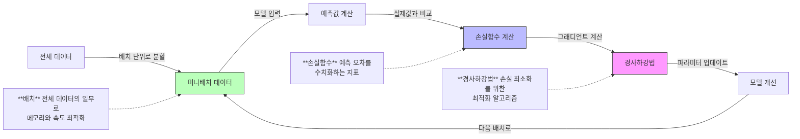

## 주제
<!-- 이번 주차에 다룬 주요 주제를 작성해주세요 -->
---
## YB심화 세션 운영방식 결정
- 사전 과제는 교재 읽고 자신이 나누고 싶은 이야기 정리해오는 것
- 복습과제, 논의한 내용 중 어려웠던 것이나 혼동되는 것, 함께 논의해서 정답을 찾지 못한 것들을 정리해오기
- 발제는 머신러닝 인터뷰 가이드라는 책으로 진행

## 2장 ML 기본 지식 (인사이드 머신러닝 인터뷰)
- 경사하강법이 쓰이는 종류와 차이점
- Nan 데이터 처리한 경험
- Overfitting에 대한 본인의 경험
- XAI 해석 가능한 인공지능
- 딥러닝과 머신러닝, 지도와 비지도 

## 내용
---
<!-- 주요 개념과 내용을 정리해주세요 -->
### 핵심 개념 1 | 경사하강법
---
#### 경사하강법은 어디에 사용되는가?
- 경사하강법(Gradient Descent)은 머신러닝 **모델에서 모델의 파라미터를 최적화 문제 해결을 위한 핵심 알고리즘**

- 모델의 예측 값과 실제 값 간의 차이를 나타내는 손실 함수(loss function)의 기울기(gradient)를 이용하여 파라미터를 업데이트
- 파라미터를 얼마나 업데이트할 것인지를 결정하는 것이 learning rate(학습률, step size) (스칼라)
- 함수의 기울기 정보를 이용해 파라미터를 반복적으로 조정하며 손실 함수의 최솟값을 찾는 기법


- **산 정상에서 안개 속에서 하산하는 과정**에 비유할 수 있는데, 눈앞의 **지형 경사만을 참고해 가장 가파른 방향으로 단계적으로 이동하는 원리**임.
$\theta_{t+1} = \theta_t - \eta \cdot \nabla J(\theta_t)$

- 현재 위치에서 주변 경사 측정  
- 경사 방향 반대(하강 시)로 발걸음 이동  
- 이동 거리 = (학습률 η) × (경사도)  
- 극소점 도달 시 반복 종료  

```python
θ_{t+1} = θ_t - η·∇J(θ_t)  # θ: 파라미터, η: 학습률, ∇J: 기울기
```
경사도가 클수록 큰 보폭으로 이동하며, 극소점 근처에선 작은 보폭으로 정밀 조정


#### 손실 함수 최소화  
**손실 함수 $J(\theta)$의 최소값 탐색 |**  
$\theta^* = \arg\min_{\theta} J(\theta)$  

**경사도 계산 |**  
$\nabla J(\theta) = \left(\frac{\partial J}{\partial \theta_1}, \frac{\partial J}{\partial \theta_2}, ..., \frac{\partial J}{\partial \theta_n}\right)$  

**파라미터 업데이트 규칙 |**  
$\theta_{\text{new}} = \theta_{\text{old}} - \eta \cdot \nabla J(\theta_{\text{old}})$  


#### 경사하강법에서 learning rate 설정하기
- Learning rate가 너무 크면 모델이 최적점을 지나칠 수 있고(overshooting), 너무 작으면 학습 속도가 느려질 수 있고, local minimum에 빠질 위험이 있음.
- Learning rate을 0.1, 0.01, 0.001로 떨어 뜨리면서 실험하는 것이 좋다. 큰값 -> 작은 값

**스케줄링**
- 특정 고정값이 아니라 규칙에 따라 학습률 적용하는 방식 
- 특정한 epoch에 따라 감소하는 Step Decay, 코사인함수를 따라 연속적으로 감소하는 Cosine Decay, 단순 감소하는 Linear Dacay, 제곱근의 역수로 감소하는 Inverse Sqrt Decay 등 
- CLR(Cyclical learning rates) : 최대 학습률(max_lr)과 최저 학습률(lr) 사이 값을 순환하게 하는 방법 &  step size는 최저 지점과 최고 지점 사이 길이

#### 경사하강법의 종류와 쓰임새  

1. **Mini-batch GD**  
   - $ \theta_{t+1} = \theta_t - \eta \frac{1}{n} \sum_{i=1}^{n} \nabla J_i(\theta_t) $  
   - $n$개의 미니배치 샘플에 대한 평균 그래디언트 사용  
   - 배치 크기는 보통 32~256 사이  

2. **Adam (Adaptive Moment Estimation)**  
   - $ m_t = \beta_1 m_{t-1} + (1 - \beta_1) \nabla J(\theta_t) $  
   - $ v_t = \beta_2 v_{t-1} + (1 - \beta_2)(\nabla J(\theta_t))^2 $  
   - $ \hat{m}_t = \frac{m_t}{1 - \beta_1^t} $  
   - $ \hat{v}_t = \frac{v_t}{1 - \beta_2^t} $  
   - $ \theta_{t+1} = \theta_t - \eta \frac{\hat{m}_t}{\sqrt{\hat{v}_t} + \epsilon} $  

3. **Batch GD**  
   - $ \theta_{t+1} = \theta_t - \eta \nabla J(\theta_t) $  
   - 전체 데이터셋에 대한 그래디언트 계산  

4. **SGD (Stochastic Gradient Descent)**  
   - $ \theta_{t+1} = \theta_t - \eta \nabla J_i(\theta_t) $  
   - 한 번에 하나의 샘플만 사용  

5. **Momentum**  
   - $ v_t = \gamma v_{t-1} + \eta \nabla J(\theta_t) $  
   - $ \theta_{t+1} = \theta_t - v_t $  
   - $\gamma$는 모멘텀 계수 (보통 0.9)  

6. **Adagrad**  
   - $ G_t = G_{t-1} + (\nabla J(\theta_t))^2 $  
   - $ \theta_{t+1} = \theta_t - \frac{\eta}{\sqrt{G_t + \epsilon}} \nabla J(\theta_t) $  

7. **RMSprop**  
   - $ v_t = \beta v_{t-1} + (1 - \beta)(\nabla J(\theta_t))^2 $  
   - $ \theta_{t+1} = \theta_t - \frac{\eta}{\sqrt{v_t + \epsilon}} \nabla J(\theta_t) $  


- 조건별 최적화 기법 비교표 
| 조건 | 추천 기법 | 주요 특징 | 장점 | 단점 |
|------|-----------|-----------|------|------|
| 데이터가 많고 연산 속도가 중요 | Mini-batch GD, Adam | 미니배치 단위 처리 | 메모리 효율적, 빠른 수렴 | 하이퍼파라미터 조정 필요 |
| 데이터가 적고 해석이 필요 | Batch GD | 전체 데이터 사용 | 안정적인 수렴 | 느린 학습 속도 |
| 빠른 학습 속도가 필요 | SGD, Momentum | 샘플 단위 처리 | 빠른 학습 | 노이즈가 많음 |
| 희소한 데이터 처리 | Adagrad, RMSprop | 적응적 학습률 | 파라미터별 최적화 | 학습률 감소 문제 |
| 안정적이고 높은 성능 필요 | Adam | 모멘텀+적응적 학습률 | 대부분 상황에서 우수 | 계산 비용 높음 |


#### Adam Optimaizer가 많이 쓰이는 이유 (개념과 수식을 중심으로)
- 
- 
### 핵심 개념 2 | 머신러닝과 딥러닝
---
#### 머신러닝과 딥러닝, 지도 비지도 분류 명확히 하기
#### 블랙박스/화이트박스
#### XAI, SHAP 등 해석 가능한 인공지능 
#### ADD | ML면접에서 헷갈리는 지도 비지도

### 핵심 개념 3 | 데이터 전처리/모델의 과대 과소적합
---
#### 오버피팅이란?
#### 오버피팅을 판별하는 일반적인 기준은? (그래프)
#### 데이터에서 Nan값은 항상 제거되야하는가?
#### 다양한 보간법

## 참고 문헌
---
<!-- 참고한 자료의 제목과 링크를 작성해주세요 -->
1. [위키백과 경사하강법](https://ko.wikipedia.org/wiki/%EA%B2%BD%EC%82%AC_%ED%95%98%EA%B0%95%EB%B2%95)
2. [모두의 연구소 글](https://modulabs.co.kr/blog/importance-of-learning-rate-and-finding-appropriate-learning-rate)
