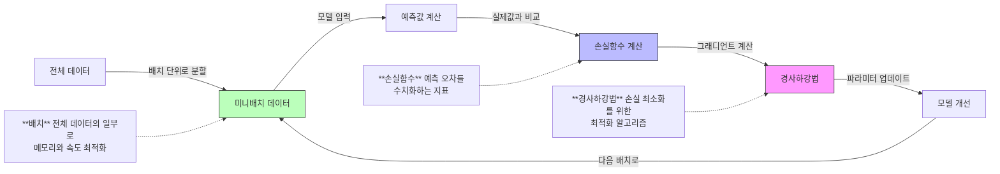
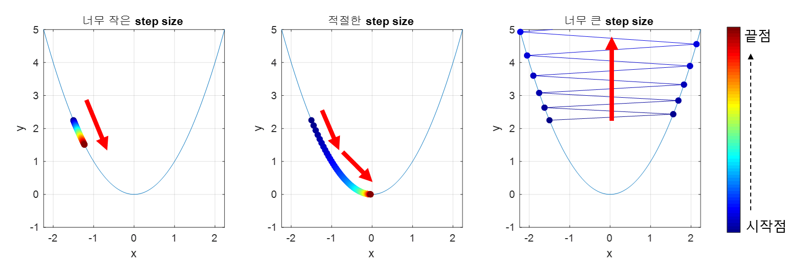
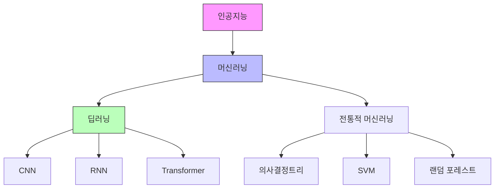
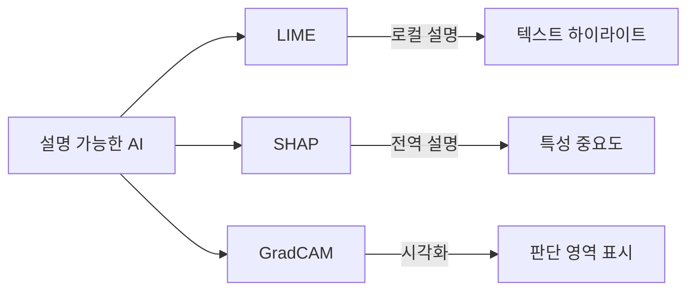
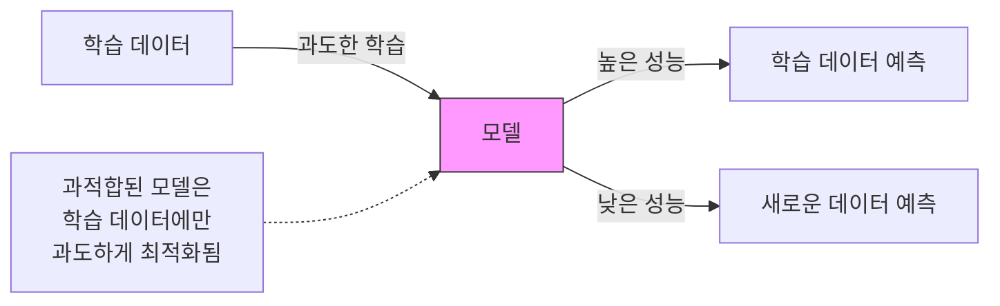
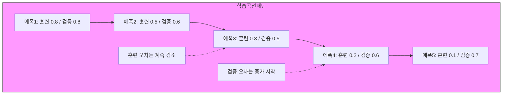

## 주제
<!-- 이번 주차에 다룬 주요 주제를 작성해주세요 -->
---
## YB심화 세션 운영방식 결정
- 사전 과제는 교재 읽고 자신이 나누고 싶은 이야기 정리해오는 것
- 복습과제, 논의한 내용 중 어려웠던 것이나 혼동되는 것, 함께 논의해서 정답을 찾지 못한 것들을 정리해오기
- 발제는 머신러닝 인터뷰 가이드라는 책으로 진행

## 2장 ML 기본 지식 (인사이드 머신러닝 인터뷰)
- 경사하강법이 쓰이는 종류와 차이점
- Nan 데이터 처리한 경험
- Overfitting에 대한 본인의 경험
- XAI 해석 가능한 인공지능
- 딥러닝과 머신러닝, 지도와 비지도 

## 내용
---
<!-- 주요 개념과 내용을 정리해주세요 -->
### 핵심 개념 1 | 경사하강법
#### 경사하강법은 어디에 사용되는가?
- 경사하강법(Gradient Descent)은 머신러닝 **모델에서 모델의 파라미터를 최적화 문제 해결을 위한 핵심 알고리즘**


- 머신러닝 모델은 큰 데이터셋을 한 번에 처리하기 어렵기 때문에 전체 데이터를 더 작은 '배치'라는 단위로 나눔. 각 배치의 데이터가 모델에 입력되면, 모델은 현재 가지고 있는 지식(파라미터)를 기반으로 예측을 수행. 모델의 예측값과 실제 정답을 비교하여 얼마나 틀렸는지를 수치화하는 데 이것이 '손실함수'의 역할. 그리고 '경사하강법'이라는 방법을 사용해 모델을 개선합니다. 이 전체 과정이 배치마다 반복됨.

- 모델의 예측 값과 실제 값 간의 차이를 나타내는 손실 함수(loss function)의 기울기(gradient)를 이용하여 파라미터를 업데이트
- 파라미터를 얼마나 업데이트할 것인지를 결정하는 것이 learning rate(학습률, step size) (스칼라)
- 함수의 기울기 정보를 이용해 파라미터를 반복적으로 조정하며 손실 함수의 최솟값을 찾는 기법


- **산 정상에서 안개 속에서 하산하는 과정**에 비유할 수 있는데, 눈앞의 **지형 경사만을 참고해 가장 가파른 방향으로 단계적으로 이동하는 원리**임.

$\theta_{t+1} = \theta_t - \eta \cdot \nabla J(\theta_t)$

- 현재 위치에서 주변 경사 측정  
- 경사 방향 반대(하강 시)로 발걸음 이동  
- 이동 거리 = (학습률 η) × (경사도)  
- 극소점 도달 시 반복 종료  

$\theta_{t+1} = \theta_t - \eta \cdot \nabla J(\theta_t)$  <!-- θ: 파라미터, η: 학습률, ∇J: 기울기 -->
- 경사도가 클수록 큰 보폭으로 이동하며, 극소점 근처에선 작은 보폭으로 정밀 조정


#### 손실 함수 최소화  
---
**손실 함수 $J(\theta)$의 최소값 탐색| **  $\theta^* = \arg\min_{\theta} J(\theta)$  

**경사도 계산 |**  $\nabla J(\theta) = \left(\frac{\partial J}{\partial \theta_1}, \frac{\partial J}{\partial \theta_2}, ..., \frac{\partial J}{\partial \theta_n}\right)$  

**파라미터 업데이트 규칙 |**  $\theta_{\text{new}} = \theta_{\text{old}} - \eta \cdot \nabla J(\theta_{\text{old}})$  


#### 경사하강법에서 learning rate 설정하기
- Learning rate가 너무 크면 모델이 최적점을 지나칠 수 있고(overshooting), 너무 작으면 학습 속도가 느려질 수 있고, local minimum에 빠질 위험이 있음.
- Learning rate을 0.1, 0.01, 0.001로 떨어 뜨리면서 실험하는 것이 좋다. 큰값 -> 작은 값

**스케줄링**
- 특정 고정값이 아니라 규칙에 따라 학습률 적용하는 방식 
- Step Decay: $\eta_t = \eta_0 \cdot \gamma^{\lfloor t/k \rfloor}$ (γ: 감소율, k: 스텝 크기)
- Cosine Decay: $\eta_t = \eta_{min} + \frac{1}{2}(\eta_{max} - \eta_{min})(1 + \cos(\frac{t\pi}{T}))$
- Linear Decay: $\eta_t = \eta_0(1 - \frac{t}{T})$
- Inverse Sqrt Decay: $\eta_t = \frac{\eta_0}{\sqrt{t+1}}$
- CLR(Cyclical learning rates): 최대 학습률(max_lr)과 최저 학습률(lr) 사이 값을 순환하게 하는 방법으로, step size는 한 사이클의 반을 의미함 (예: 최저점에서 최고점까지의 epoch 수)

#### 경사하강법의 한계점
- Local minimum 문제 | 경사하강법은 현재 위치에서 가장 가파른 방향으로만 이동하기 때문에, **전체 최적값(global minimum)이 아닌 지역 최적값(local minimum)**에 빠질 수 있음
- 초기값 의존성 | 파라미터의 초기값 설정에 따라 최종 결과가 크게 달라질 수 있음. 특히 딥러닝에서는 적절한 초기화가 매우 중요
- 계산 비용 | 데이터셋이 큰 경우, 매 스텝마다 전체 데이터에 대한 그래디언트를 계산해야 하므로 계산 비용이 매우 큼 (이를 해결하기 위해 미니배치 방식 사용)
- 하이퍼파라미터 조정 | Learning rate를 포함한 여러 하이퍼파라미터의 적절한 값을 찾는 것이 어려움

#### 경사하강법의 종류와 쓰임새  
1. **Mini-batch GD**  
$ \theta_{t+1} = \theta_t - \eta \frac{1}{n} \sum_{i=1}^{n} \nabla J_i(\theta_t) $  
   - $n$개의 미니배치 샘플에 대한 평균 그래디언트 사용  
   - 배치 크기는 보통 32~256 사이  

2. **Adam (Adaptive Moment Estimation)**  
$ m_t = \beta_1 m_{t-1} + (1 - \beta_1) \nabla J(\theta_t) $  
$ v_t = \beta_2 v_{t-1} + (1 - \beta_2)(\nabla J(\theta_t))^2 $  
$ \hat{m}_t = \frac{m_t}{1 - \beta_1^t} $  
$ \hat{v}_t = \frac{v_t}{1 - \beta_2^t} $  
$ \theta_{t+1} = \theta_t - \eta \frac{\hat{m}_t}{\sqrt{\hat{v}_t} + \epsilon} $  

3. **Batch GD**  
$ \theta_{t+1} = \theta_t - \eta \nabla J(\theta_t) $  
   - 전체 데이터셋에 대한 그래디언트 계산  

4. **SGD (Stochastic Gradient Descent)**  
$ \theta_{t+1} = \theta_t - \eta \nabla J_i(\theta_t) $  
   - 한 번에 하나의 샘플만 사용  

5. **Momentum**  
$ v_t = \gamma v_{t-1} + \eta \nabla J(\theta_t) $  
$ \theta_{t+1} = \theta_t - v_t $  
   - $\gamma$ 는 모멘텀 계수 (보통 0.9)  

6. **Adagrad**  
$ G_t = G_{t-1} + (\nabla J(\theta_t))^2 $  
$ \theta_{t+1} = \theta_t - \frac{\eta}{\sqrt{G_t + \epsilon}} \nabla J(\theta_t) $  

7. **RMSprop**  
$ v_t = \beta v_{t-1} + (1 - \beta)(\nabla J(\theta_t))^2 $  
$ \theta_{t+1} = \theta_t - \frac{\eta}{\sqrt{v_t + \epsilon}} \nabla J(\theta_t) $  

#### 조건별 최적화 기법 비교

| 조건 | 추천 기법 | 주요 특징 | 장점 | 단점 |
|------|-----------|-----------|-------|-------|
| 데이터가 많고 연산 속도가 중요 | Mini-batch GD, Adam | 미니배치 단위 처리 | 메모리 효율적, 빠른 수렴 | 하이퍼파라미터 조정 필요 |
| 데이터가 적고 해석이 필요 | Batch GD | 전체 데이터 사용 | 안정적인 수렴 | 느린 학습 속도 |
| 빠른 학습 속도가 필요 | SGD, Momentum | 샘플 단위 처리 | 빠른 학습 | 노이즈가 많음 |
| 희소한 데이터 처리 | Adagrad, RMSprop | 적응적 학습률 | 파라미터별 최적화 | 학습률 감소 문제 |
| 안정적이고 높은 성능 필요 | Adam | 모멘텀+적응적 학습률 | 대부분 상황에서 우수 | 계산 비용 높음 |

#### Adam Optimaizer가 많이 쓰이는 이유 (개념과 수식을 중심으로) [Optimizer 관련 포스팅](https://walkaroundthedevelop.tistory.com/105)
- 위에서 언급했듯 Momentum과 RMSprop의 장점이 결합되어 있음.
    - 이전 그래디언트의 방향성이 유지가 되었고, 적응적 학습률로 파라미터별 업데이트를 최적화화한다.
### 핵심 개념 2 | 머신러닝과 딥러닝
#### 머신러닝과 딥러닝의 관계 | 
- 머신러닝은 데이터로부터 패턴을 학습하여 작업을 수행하는 AI의 한 분야
- 딥러닝은 머신러닝의 한 종류로, 인공신경망을 깊게 쌓아 복잡한 패턴을 학습하는 방법



#### 학습 방식에 따른 분류 |
- **지도학습(Supervised Learning)** | 입력과 정답(레이블)이 쌍으로 제공되는 학습 방식
  - 분류(Classification) | 이미지 분류, 스팸 메일 탐지
  - 회귀(Regression) | 주식 가격 예측, 판매량 예측

- **비지도학습(Unsupervised Learning)** | 레이블 없이 데이터의 패턴을 스스로 학습
  - 군집화(Clustering) | 고객 세그먼트 분류, 이상치 탐지
  - 차원 축소(Dimension Reduction) | PCA, t-SNE

- **준지도학습(Semi-supervised Learning)** | 레이블이 있는 데이터와 없는 데이터를 모두 활용
  - 적은 양의 레이블 데이터로 시작하여 점진적으로 학습
  - 데이터 레이블링 비용 절감 가능

- **강화학습(Reinforcement Learning)** | 환경과 상호작용하며 보상을 통해 학습
  - 게임 AI, 로봇 제어, 자율주행 등에 활용

#### 블랙박스 vs 화이트박스  
| 구분 | 블랙박스 모델 | 화이트박스 모델 |  
|------|---------------|----------------|  
| **예시** | 딥러닝(CNN, RNN) | 선형 회귀, 의사결정트리 |  
| **해석성** | 낮음 (계층적 특성 추상화) | 높음 (규칙 기반) |  
| **트레이드오프** | 성능 ↑ vs 설명력 ↓ | 성능 ↓ vs 설명력 ↑ |  

---

### 설명 가능한 AI(XAI) 기술  

#### 핵심 기법 비교  
| 기술 | 작동 원리 | 적용 분야 |  
|------|-----------|-----------|  
| **LIME** | 로컬 영역 선형 근사 모델 생성 | 텍스트/이미지 분류 |  
| **SHAP** | 게임 이론 기반 특성 기여도 계산 | 금융 리스크 평가 |  
| **Grad-CAM** | CNN 특징 맵 가중치 시각화 | 의료 영상 분석 |  




#### ML 면접에서 헷갈리는 지도/비지도의 포함관계 |
- **자주 나오는 질문들** |
  1. "오토인코더는 지도학습인가요, 비지도학습인가요?"
     - 입력=출력이므로 기술적으로는 지도학습이지만, 레이블이 필요 없어 비지도학습으로 분류

  2. "군집화 결과를 분류에 사용하면 어떤 학습인가요?"
     - 군집화(비지도) → 분류(지도)의 파이프라인이므로 준지도학습의 한 형태

  3. "GANs은 어떤 학습 방식인가요?"
     - 생성기(비지도)와 판별기(지도)가 결합된 형태로, 전체적으로는 비지도학습으로 분류

- **판단 기준** |
  - 레이블 사용 여부가 핵심 기준
  - 학습 과정에서 정답이 필요하면 지도학습
  - 최종 목적이 패턴 발견이면 비지도학습
  - 두 가지가 혼합되면 준지도학습으로 볼 수 있음

### 핵심 개념 3 | 데이터 전처리/모델의 과대 과소적합
---
#### 오버피팅이란? |
- 모델이 학습 데이터에 과도하게 맞춰져서 새로운 데이터에 대한 일반화 성능이 떨어지는 현상
- 마치 시험 문제와 똑같은 기출문제만 풀 수 있고, 응용문제는 못 푸는 학생과 비슷한 상황



#### 오버피팅을 판별하는 기준 |
- **학습 곡선 분석** |
  - 훈련 세트 오차 vs 검증 세트 오차의 차이가 큼
  - 훈련 세트 성능은 계속 향상되나 검증 세트 성능은 악화
  - 일반적으로 아래와 같은 패턴을 보임


#### 과적합 방지 기법 |

  1. 정규화(Regularization) | L1, L2 정규화로 모델의 복잡도 제한
  2. 드롭아웃(Dropout) | 뉴런을 무작위로 비활성화하여 일반화 성능 향상
  3. 조기 종료(Early Stopping) | 검증 오차가 증가하기 시작하면 학습 중단
  4. 데이터 증강(Data Augmentation) | 학습 데이터를 인위적으로 늘려 다양성 확보

1. **정규화(Regularization)** |
   - L1 정규화(Lasso): $Loss + \lambda\sum_{i=1}^n|\theta_i|$
     - 불필요한 특성의 가중치를 0으로 만들어 feature selection 효과
   - L2 정규화(Ridge): $Loss + \lambda\sum_{i=1}^n\theta_i^2$
     - 가중치를 전체적으로 작게 만들어 모델을 단순화
   - Elastic Net: L1과 L2의 조합
     ```python
     from sklearn.linear_model import ElasticNet
     model = ElasticNet(alpha=0.1, l1_ratio=0.5)
     ```

2. **드롭아웃(Dropout)** |
   - 학습 시 각 뉴런을 p의 확률로 비활성화
   - 앙상블 효과를 내며 모델의 견고성 향상
   ```python
   model.add(tf.keras.layers.Dropout(0.5))
   ```

3. **조기 종료(Early Stopping)** |
   ```python
   early_stopping = tf.keras.callbacks.EarlyStopping(
       monitor='val_loss',
       patience=10,
       restore_best_weights=True
   )
   ```

4. **데이터 증강(Data Augmentation)** |
   ```python
   data_augmentation = tf.keras.Sequential([
       layers.RandomFlip("horizontal"),
       layers.RandomRotation(0.1),
       layers.RandomZoom(0.1),
   ])
   ```

#### 결측치(NaN) 처리 |
- **결측치 제거가 적절한 경우** |
  - 결측치가 전체 데이터의 5% 미만일 때
  - 결측치가 완전 무작위(MCAR)인 경우
  - 데이터가 충분히 많아 제거해도 문제없는 경우

- **결측치 제거가 부적절한 경우** |
  - 결측 자체가 중요한 의미를 가질 때 (예: 설문 응답 거부)
  - 결측치가 특정 패턴을 가질 때 (MAR, MNAR)
  - 데이터가 부족하여 모든 데이터가 중요할 때

#### 다양한 보간법 |
- **통계적 보간법** |
  - 평균값 대체 | 가장 단순하지만 분산을 과소추정할 위험
  - 중앙값 대체 | 이상치에 강건한 방법
  - 최빈값 대체 | 범주형 변수에 적합

- **고급 보간법** |
  1. KNN 보간 | 유사한 데이터의 값으로 대체
     ```python
     from sklearn.impute import KNNImputer
     imputer = KNNImputer(n_neighbors=5)
     ```
  
  2. 회귀 보간 | 다른 변수들로 결측값 예측
     ```python
     from sklearn.impute import SimpleImputer
     imputer = SimpleImputer(strategy='linear')
     ```
  
  3. 다중대체(Multiple Imputation) | 여러 가능한 값을 생성하여 불확실성 반영
     ```python
     from sklearn.experimental import enable_iterative_imputer
     from sklearn.impute import IterativeImputer
     ```
#### 시계열 데이터 보간법 |
1. **선형 보간(Linear Interpolation)** |
   - 수식: $y = y_1 + \frac{y_2-y_1}{x_2-x_1}(x-x_1)$
   ```python
   import pandas as pd
   df['column'].interpolate(method='linear')
   ```

2. **스플라인 보간(Spline Interpolation)** |
   - 3차 스플라인 보간이 가장 일반적
   - 부드러운 곡선을 만들기 위해 3차 다항식 사용
   ```python
   # scipy를 사용한 3차 스플라인 보간
   from scipy.interpolate import CubicSpline
   cs = CubicSpline(x, y)
   y_interpolated = cs(x_new)
   
   # pandas에서 직접 사용
   df['column'].interpolate(method='cubic')
   ```

3. **계절성을 고려한 보간(Seasonal Interpolation)** |
   ```python
   def seasonal_interpolate(series, period):
       # 계절성 주기별로 분리
       seasonal_series = []
       for i in range(period):
           seasonal_series.append(series[i::period])
       
       # 각 계절별로 보간
       for s in seasonal_series:
           s.interpolate(method='linear', inplace=True)
       
       # 다시 하나의 시리즈로 병합
       result = pd.concat(seasonal_series).sort_index()
       return result

   # 예: 월별 데이터의 계절성 보간 (주기=12)
   df['seasonal_interpolated'] = seasonal_interpolate(df['column'], 12)
   ```

4. **SARIMA 모델을 활용한 보간** |
   ```python
   from statsmodels.tsa.statespace.sarimax import SARIMAX
   
   # 계절성을 고려한 SARIMA 모델
   model = SARIMAX(df['column'], 
                   order=(1, 1, 1),
                   seasonal_order=(1, 1, 1, 12))
   
   # 결측값 위치에 예측값 채우기
   fitted = model.fit()
   df['sarima_interpolated'] = fitted.predict(dynamic=False)
   ```


## 참고 문헌
---
<!-- 참고한 자료의 제목과 링크를 작성해주세요 -->
1. [위키백과 경사하강법](https://ko.wikipedia.org/wiki/%EA%B2%BD%EC%82%AC_%ED%95%98%EA%B0%95%EB%B2%95)
2. [모두의 연구소 글](https://modulabs.co.kr/blog/importance-of-learning-rate-and-finding-appropriate-learning-rate)
3. https://www.codestates.com/blog/content/%EB%A8%B8%EC%8B%A0%EB%9F%AC%EB%8B%9D-%EB%94%A5%EB%9F%AC%EB%8B%9D%EA%B0%9C%EB%85%90
