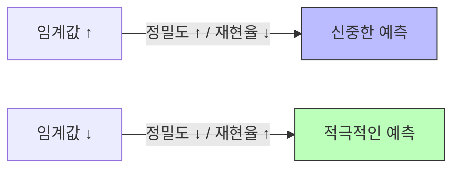
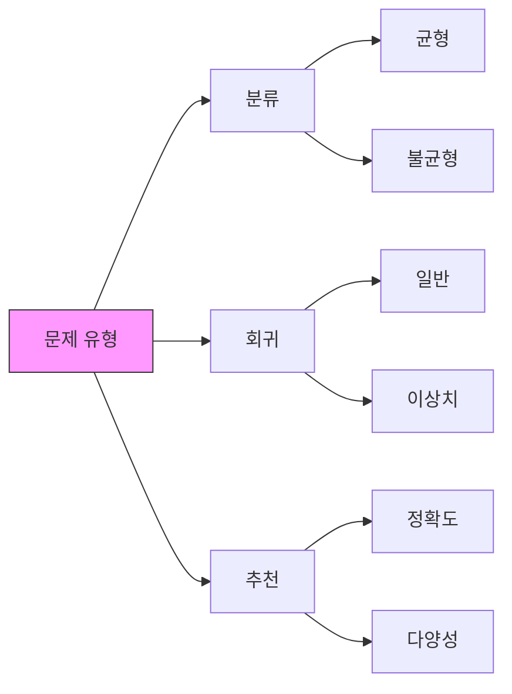

## 주제
---
<!-- 이번 주차에 다룬 주요 주제를 작성해주세요 -->
2장 ML 기본 지식
3장 ML 코딩
---

1️⃣ 모델 평가와 성능 지표
- Precision & Recall Trade-off의 실제 적용
- nDCG를 활용한 추천시스템 랭킹 평가
- 지니 지수의 의미와 해석
- 상황별 최적 평가 지표 선정

2️⃣ 심층 신경망 구조와 응용
- 오토인코더와 Transformer의 관계
- 이미지 처리를 위한 오토인코더 활용
- GAN의 기본 작동 원리
- 다양한 거리 측정 방식의 특징

3️⃣ 데이터 처리와 알고리즘
- EM 알고리즘과 K-means 클러스터링
- 저수지 샘플링의 개념과 적용
- TF-IDF를 통한 텍스트 중요도 계산
- 차원 축소 기법 (PCA, KLD)

## 내용
### 핵심 개념 1 | 모델 평가와 성능 지표
---
#### Precision & Recall Trade-off |
- **정밀도(Precision)** | 모델이 Positive로 예측한 것 중 실제 Positive의 비율
  - $Precision = \frac{TP}{TP + FP}$
  - 스팸 메일 필터링처럼 False Positive가 치명적인 경우 중요

- **재현율(Recall)** | 실제 Positive 중 모델이 맞춘 비율
  - $Recall = \frac{TP}{TP + FN}$
  - 암 진단처럼 False Negative가 치명적인 경우 중요



- **실제 적용 예시** |
  1. 의료 진단 | 높은 재현율 필요 (진짜 환자를 놓치면 안 됨)
  2. 스팸 필터 | 높은 정밀도 필요 (정상 메일을 스팸으로 분류하면 안 됨)
  3. 추천 시스템 | 비즈니스 목적에 따라 조절 (CTR vs 다양성)

#### nDCG를 활용한 추천시스템 평가 |
- **DCG(Discounted Cumulative Gain)** |
  - $DCG@k = \sum_{i=1}^k \frac{rel_i}{\log_2(i+1)}$
  - 순위가 뒤로 갈수록 가중치를 로그적으로 감소
  - rel_i는 i번째 아이템의 관련성 점수

- **nDCG(normalized DCG)** |
  - $nDCG@k = \frac{DCG@k}{IDCG@k}$
  - IDCG는 이상적인(perfect) 순위에서의 DCG
  - 0~1 사이 값으로 정규화되어 비교 용이

```python
def calculate_ndcg(predicted_ranks, true_ranks, k):
    dcg = sum((2**true_ranks[i] - 1) / np.log2(i + 2) 
              for i in range(min(k, len(predicted_ranks))))
    idcg = sum((2**sorted(true_ranks, reverse=True)[i] - 1) / np.log2(i + 2) 
               for i in range(min(k, len(true_ranks))))
    return dcg / idcg if idcg > 0 else 0
```

#### 지니 지수 |
- **의미** | 불평등도를 측정하는 지표로, 0(완전 평등)에서 1(완전 불평등) 사이의 값
- **결정 트리에서의 활용** | 노드 분할 기준으로 사용
  - $Gini = 1 - \sum_{i=1}^c p_i^2$
  - c는 클래스 수, p_i는 각 클래스의 비율

```python
def gini_index(y):
    _, counts = np.unique(y, return_counts=True)
    probabilities = counts / len(y)
    return 1 - sum(p * p for p in probabilities)
```

#### 상황별 최적 평가 지표 |
네, 좋은 제안입니다. 상황별 평가 지표를 표로 정리하고, 주요 평가 지표의 계산법을 추가하겠습니다. 해당 부분만 수정된 버전을 보여드리겠습니다:

#### 상황별 최적 평가 지표 |

| 문제 유형 | 상황 | 추천 지표 | 설명 |
|---------|------|----------|------|
| **분류** | 균형 데이터 | Accuracy, F1-score | 클래스 간 데이터 수가 비슷할 때 |
| | 불균형 데이터 | AUC-ROC, PR-AUC | 한 클래스가 매우 적은 경우 |
| | 다중 클래스 | Macro/Micro F1 | 여러 클래스 분류 시 |
| **회귀** | 일반적 경우 | MSE, RMSE, MAE | 연속값 예측의 기본 지표 |
| | 이상치 많음 | MAE, MAPE | 이상치에 덜 민감한 지표 |
| | 상대오차 중요 | MAPE, RMSPE | 크기에 따른 오차 중요도가 다를 때 |
| **추천** | 순위 중요 | nDCG, MAP | 추천 순서가 중요한 경우 |
| | 개인화 중요 | User-wise Precision | 개인별 추천 정확도가 중요할 때 |
| | 다양성 중요 | Coverage, Diversity | 추천의 다양성이 중요한 경우 |
| **시계열** | 추세 중시 | MASE, RMSE | 전반적인 추세 예측이 중요할 때 |
| | 계절성 중시 | Seasonal Adjusted | 주기적 패턴이 중요한 경우 |
| | 이상치 탐지 | Precision@k | 특이 패턴 감지가 중요할 때 |

#### 주요 평가 지표 계산법 |
**분류 평가 지표** |
- Accuracy | $Accuracy = \frac{TP + TN}{TP + TN + FP + FN}$
- F1-score | $F1 = 2 \cdot \frac{Precision \cdot Recall}{Precision + Recall}$
- Macro F1 | $MacroF1 = \frac{1}{n}\sum_{i=1}^n F1_i$ (n: 클래스 수)

**회귀 평가 지표** |
- MSE | $MSE = \frac{1}{n}\sum_{i=1}^n (y_i - \hat{y}_i)^2$
- RMSE | $RMSE = \sqrt{\frac{1}{n}\sum_{i=1}^n (y_i - \hat{y}_i)^2}$
- MAE | $MAE = \frac{1}{n}\sum_{i=1}^n |y_i - \hat{y}_i|$
- MAPE | $MAPE = \frac{100}{n}\sum_{i=1}^n |\frac{y_i - \hat{y}_i}{y_i}|$

**순위 평가 지표** |
- DCG | $DCG@k = \sum_{i=1}^k \frac{2^{rel_i} - 1}{\log_2(i+1)}$
- nDCG | $nDCG@k = \frac{DCG@k}{IDCG@k}$
- MAP | $MAP = \frac{1}{U}\sum_{u=1}^U AP_u$ (U: 사용자 수)

**시계열 평가 지표** |
- MASE | $MASE = \frac{MAE}{MAE_{naive}}$
- SMAPE | $SMAPE = \frac{100}{n}\sum_{i=1}^n \frac{|y_i - \hat{y}_i|}{(|y_i| + |\hat{y}_i|)/2}$

### 주요 고급 평가 지표 상세 설명 |

#### ROC-AUC & PR-AUC |
- **ROC(Receiver Operating Characteristic) 곡선** |
  - False Positive Rate(x축)과 True Positive Rate(y축)의 관계를 나타내는 곡선
  - $TPR = \frac{TP}{TP + FN}$, $FPR = \frac{FP}{FP + TN}$
  - AUC(Area Under Curve)는 이 곡선 아래 면적으로, 1에 가까울수록 좋은 성능

- **PR(Precision-Recall) 곡선** |
  - Precision(y축)과 Recall(x축)의 관계를 나타내는 곡선
  - 불균형 데이터셋에서 ROC-AUC보다 더 유용
  - PR-AUC가 높을수록 불균형 상황에서도 좋은 성능

```python
from sklearn.metrics import roc_auc_score, average_precision_score

# ROC-AUC
roc_auc = roc_auc_score(y_true, y_pred_proba)

# PR-AUC
pr_auc = average_precision_score(y_true, y_pred_proba)
```

#### Precision@k & 순위 기반 지표 |
- **Precision@k** |
  - 상위 k개 추천/예측 중 관련된 항목의 비율
  - $Precision@k = \frac{\text{relevant items in top k}}{k}$
  - 특히 추천시스템에서 많이 사용

- **MAP(Mean Average Precision)** |
  - 각 관련 항목의 위치를 고려한 정밀도의 평균
  - $AP = \frac{\sum_{k=1}^n P@k \times rel(k)}{\text{관련 항목 수}}$
  - $MAP = \frac{1}{U}\sum_{u=1}^U AP_u$ (U: 사용자 수)

```python
def precision_at_k(y_true, y_pred, k):
    # 상위 k개 중 실제 관련 항목 수
    top_k = y_pred.argsort()[-k:][::-1]
    return np.mean(y_true[top_k])
```

#### 추천 시스템 특화 지표 |
- **User-wise Precision** |
  - 각 사용자별로 계산된 정밀도의 평균
  - 개인화 성능을 더 정확히 평가 가능
  ```python
  def user_wise_precision(recommendations, actual):
      precisions = []
      for user in actual:
          user_recs = set(recommendations[user])
          user_actual = set(actual[user])
          precision = len(user_recs & user_actual) / len(user_recs)
          precisions.append(precision)
      return np.mean(precisions)
  ```

- **Coverage** |
  - 전체 아이템 중 실제로 추천된 아이템의 비율
  - $Coverage = \frac{\text{추천된 unique 아이템 수}}{\text{전체 아이템 수}}$
  - 추천의 다양성을 평가

- **Diversity** |
  - 추천 목록 내 아이템들의 다양성
  - 보통 아이템 간 유사도의 역수로 계산
  ```python
  def diversity_score(recommendations, item_features):
      diversities = []
      for user_recs in recommendations:
          pairs = combinations(user_recs, 2)
          pair_diversities = [1 - cosine_similarity(item_features[i], item_features[j])
                            for i, j in pairs]
          diversities.append(np.mean(pair_diversities))
      return np.mean(diversities)
  ```

#### 시계열 특화 지표 |
- **Seasonal Adjusted 메트릭** |
  - 계절성을 제거한 후의 예측 성능 평가
  - 주기적 패턴을 제거하고 실제 트렌드 캡처 능력 평가
  ```python
  def seasonal_adjusted_error(y_true, y_pred, period):
      # 계절성 성분 추출
      seasonal = seasonal_decompose(y_true, period=period).seasonal
      # 계절성 제거 후 평가
      adj_true = y_true - seasonal
      adj_pred = y_pred - seasonal
      return mean_squared_error(adj_true, adj_pred)
  ```

#### nDCG 상세 설명 |
- **관련성 점수 반영** |
  - 단순한 순서가 아닌 관련성의 정도를 반영
  - 예: 5점 척도 평점을 관련성 점수로 사용

- **로그 할인** |
  - 순위가 뒤로 갈수록 가중치 감소
  - 사용자가 상위 항목에 더 주목한다는 가정 반영

```python
def ndcg_score(true_relevance, predicted_ranking, k=None):
    if k is None:
        k = len(true_relevance)
        
    # DCG 계산
    dcg = 0
    for i, pred_idx in enumerate(predicted_ranking[:k]):
        rel = true_relevance[pred_idx]
        dcg += (2**rel - 1) / np.log2(i + 2)
        
    # IDCG 계산
    ideal_ranking = sorted(true_relevance, reverse=True)
    idcg = 0
    for i, rel in enumerate(ideal_ranking[:k]):
        idcg += (2**rel - 1) / np.log2(i + 2)
        
    return dcg / idcg if idcg > 0 else 0
```




### 핵심 개념 2 | 심층 신경망 구조와 응용
---
#### 오토인코더와 Transformer의 관계

####  이미지 처리를 위한 오토인코더 활용

#### GAN의 기본 작동 원리

#### 다양한 거리 측정 방식의 특징


### 핵심 개념 3 | 데이터 처리와 알고리즘
---
#### EM 알고리즘과 K-means 클러스터링

#### 저수지 샘플링의 개념과 적용

#### TF-IDF를 통한 텍스트 중요도 계산

#### 차원 축소 기법 (PCA, KLD)

## 참고 문험
---
