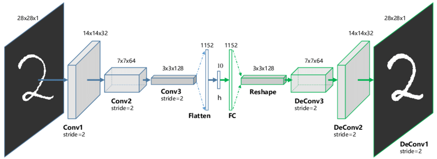

## 주제
2장 ML 기본 지식 &
3장 ML 코딩
---

1️⃣ 모델 평가와 성능 지표
- Precision & Recall Trade-off의 실제 적용
- nDCG를 활용한 추천시스템 랭킹 평가
- 지니 지수의 의미와 해석
- 상황별 최적 평가 지표 선정

2️⃣ 심층 신경망 구조와 응용
- 오토인코더와 Transformer의 관계
- 이미지 처리를 위한 오토인코더 활용
- GAN의 기본 작동 원리
- 다양한 거리 측정 방식의 특징

3️⃣ 데이터 처리와 알고리즘
- EM 알고리즘과 K-means 클러스터링
- 저수지 샘플링의 개념과 적용
- TF-IDF를 통한 텍스트 중요도 계산
- 차원 축소 기법 (PCA, KLD)

## 내용
### 핵심 개념 1 | 모델 평가와 성능 지표
---
#### Precision & Recall Trade-off |
- **정밀도(Precision)** | 모델이 Positive로 예측한 것 중 실제 Positive의 비율
  - $Precision = \frac{TP}{TP + FP}$
  - 스팸 메일 필터링처럼 False Positive가 치명적인 경우 중요

- **재현율(Recall)** | 실제 Positive 중 모델이 맞춘 비율
  - $Recall = \frac{TP}{TP + FN}$
  - 암 진단처럼 False Negative가 치명적인 경우 중요


- **실제 적용 예시** |
  1. 의료 진단 | 높은 재현율 필요 (진짜 환자를 놓치면 안 됨)
  2. 스팸 필터 | 높은 정밀도 필요 (정상 메일을 스팸으로 분류하면 안 됨)
  3. 추천 시스템 | 비즈니스 목적에 따라 조절 (CTR vs 다양성)


#### nDCG를 활용한 추천시스템 평가 |
- **DCG(Discounted Cumulative Gain)** |
  - $DCG@k = \sum_{i=1}^k \frac{rel_i}{\log_2(i+1)}$
  - 순위가 뒤로 갈수록 가중치를 로그적으로 감소
  - rel_i는 i번째 아이템의 관련성 점수

- **nDCG(normalized DCG)** |
  - $nDCG@k = \frac{DCG@k}{IDCG@k}$
  - IDCG는 이상적인(perfect) 순위에서의 DCG
  - 0~1 사이 값으로 정규화되어 비교 용이

```python
def calculate_ndcg(predicted_ranks, true_ranks, k):
    dcg = sum((2**true_ranks[i] - 1) / np.log2(i + 2) 
              for i in range(min(k, len(predicted_ranks))))
    idcg = sum((2**sorted(true_ranks, reverse=True)[i] - 1) / np.log2(i + 2) 
               for i in range(min(k, len(true_ranks))))
    return dcg / idcg if idcg > 0 else 0
```

#### 지니 지수 |
- **의미** | 불평등도를 측정하는 지표로, 0(완전 평등)에서 1(완전 불평등) 사이의 값
- **결정 트리에서의 활용** | 노드 분할 기준으로 사용
  - $Gini = 1 - \sum_{i=1}^c p_i^2$
  - c는 클래스 수, p_i는 각 클래스의 비율

```python
def gini_index(y):
    _, counts = np.unique(y, return_counts=True)
    probabilities = counts / len(y)
    return 1 - sum(p * p for p in probabilities)
```
#### ++ Information Gain
#### 정보 이득(Information Gain) |
- 이 특성을 사용하면 분류가 얼마나 더 잘 되는가?
    예시 ) 날씨에 따른 테니스 경기 진행 여부 데이터
    * 전체 데이터:
        - 진행: 9회, 취소: 5회 (불확실성 높음)
        
    * '비가 오는가?' 특성으로 나누면:
        - 비옴 → 취소: 4회, 진행: 0회 (매우 확실!)
        - 안옴 → 취소: 1회, 진행: 9회 (꽤 확실!)

        → '비가 오는가?' 특성은 정보 이득이 높음!
- **엔트로피(Entropy)** |
  - 데이터의 불순도/불확실성을 측정
  - $H(X) = -\sum_{i=1}^n p(x_i)\log_2p(x_i)$
  - 값이 클수록 불확실성이 높음

```python
def entropy(y):
    """클래스 레이블의 엔트로피 계산"""
    if len(y) == 0:
        return 0
    counts = np.bincount(y)
    probs = counts[counts > 0] / len(y)
    return -np.sum(probs * np.log2(probs))
```

- **정보 이득** |
  - 특성으로 분할하기 전후의 엔트로피 차이
  - $IG(Y,X) = H(Y) - H(Y|X)$
  - 의사결정트리에서 분할 기준으로 사용


- **특징과 활용** |
  1. 의사결정트리에서 분할 기준 선택
  2. 특성 선택(Feature Selection)에 활용
  3. 범주형 변수에 특히 유용
  4. 0에서 log2(n_classes)사이의 값을 가짐

- **다른 불순도 측정 방법과 비교** |
  | 측정 방법 | 수식 | 특징 |
  |----------|------|------|
  | 엔트로피 | $-\sum p_i\log_2p_i$ | • 정보이론 기반<br>• 다중 클래스에 적합 |
  | 지니 지수 | $1-\sum p_i^2$ | • 계산이 상대적으로 단순<br>• 이진 분류에 효과적 |
  | 분류 오차 | $1-\max(p_i)$ | • 가장 단순한 방법<br>• 덜 민감한 측정 |

```python
def information_gain(X, y, feature_idx):
    """특성의 정보 이득 계산"""
    total_entropy = entropy(y)
    
    # 특성값에 따른 조건부 엔트로피 계산
    values = np.unique(X[:, feature_idx])
    weighted_entropy = 0
    for value in values:
        mask = X[:, feature_idx] == value
        prop = np.sum(mask) / len(y)
        weighted_entropy += prop * entropy(y[mask])
    
    return total_entropy - weighted_entropy
```

#### 상황별 최적 평가 지표 |
| 문제 유형 | 상황 | 추천 지표 | 설명 |
|---------|------|----------|------|
| **분류** | 균형 데이터 | Accuracy, F1-score | 클래스 간 데이터 수가 비슷할 때 |
| | 불균형 데이터 | AUC-ROC, PR-AUC | 한 클래스가 매우 적은 경우 |
| | 다중 클래스 | Macro/Micro F1 | 여러 클래스 분류 시 |
| **회귀** | 일반적 경우 | MSE, RMSE, MAE | 연속값 예측의 기본 지표 |
| | 이상치 많음 | MAE, MAPE | 이상치에 덜 민감한 지표 |
| | 상대오차 중요 | MAPE, RMSPE | 크기에 따른 오차 중요도가 다를 때 |
| **추천** | 순위 중요 | nDCG, MAP | 추천 순서가 중요한 경우 |
| | 개인화 중요 | User-wise Precision | 개인별 추천 정확도가 중요할 때 |
| | 다양성 중요 | Coverage, Diversity | 추천의 다양성이 중요한 경우 |
| **시계열** | 추세 중시 | MASE, RMSE | 전반적인 추세 예측이 중요할 때 |
| | 계절성 중시 | Seasonal Adjusted | 주기적 패턴이 중요한 경우 |
| | 이상치 탐지 | Precision@k | 특이 패턴 감지가 중요할 때 |

### 평가 지표의 종류와 특성 |

```mermaid
flowchart TB
    M[평가 지표 분류] --> C[분류 문제]
    M --> R[회귀 문제]
    M --> RS[추천 시스템]
    M --> TS[시계열 분석]
    M --> AD[이상치 탐지]
    
    C --> C1[Accuracy<br>F1-score<br>Macro F1<br>Micro F1<br>AUC-ROC<br>PR-AUC]
    R --> R1[MSE<br>RMSE<br>MAE<br>MAPE<br>RMSPE]
    RS --> RS1[nDCG<br>MAP<br>User-wise Precision<br>Coverage<br>Diversity]
    TS --> TS1[MASE<br>Seasonal Adjusted]
    AD --> AD1[Precision@k]
    
    style M fill:#f9f,stroke:#333
    style C fill:#bbf,stroke:#333
    style R fill:#bfb,stroke:#333
    style RS fill:#fbb,stroke:#333
    style TS fill:#bff,stroke:#333
    style AD fill:#fbf,stroke:#333
```

#### 분류 문제 관련 지표 |
| 지표 | 수식 | 계산 요소 | 특징 및 장점 |
|------|------|-----------|--------------|
| Accuracy | $\frac{TP + TN}{TP + TN + FP + FN}$ | TP, TN, FP, FN | • 0~1 사이 값, 1에 가까울수록 좋음<br>• 간단하고 직관적인 지표<br>• 균형 데이터셋에 적합 |
| F1-score | $\frac{2 * Precision * Recall}{Precision + Recall}$ | Precision, Recall | • 0~1 사이 값, 1에 가까울수록 좋음<br>• 정밀도와 재현율의 조화평균<br>• 불균형 데이터셋에 유용 |
| Macro F1 | 각 클래스의 F1-score의 평균 | 각 클래스의 F1-score | • 0~1 사이 값, 1에 가까울수록 좋음<br>• 다중 클래스 분류에 적합<br>• 각 클래스에 동일한 가중치 부여 |
| Micro F1 | 전체 TP, FP, FN으로 계산한 F1-score | 전체 TP, FP, FN | • 0~1 사이 값, 1에 가까울수록 좋음<br>• 다중 클래스 분류에 적합<br>• 클래스 불균형을 고려함 |
| AUC-ROC | ROC 곡선 아래 면적 | TPR, FPR | • 0~1 사이 값, 1에 가까울수록 좋음<br>• 분류 임계값에 불변<br>• 불균형 데이터셋에 유용 |
| PR-AUC | PR 곡선 아래 면적 | Precision, Recall | • 0~1 사이 값, 1에 가까울수록 좋음<br>• 불균형 데이터셋에 특히 유용<br>• 양성 클래스에 초점 |


[AUC와 PR 설명 깔끔한 벨로그](https://data-minggeul.tistory.com/10)

#### 회귀 문제 관련 지표 |
| 지표 | 수식 | 계산 요소 | 특징 및 장점 |
|------|------|-----------|--------------|
| MSE | $\frac{1}{n}\sum_{i=1}^n (y_i - \hat{y}_i)^2$ | 실제값, 예측값 | • 0에 가까울수록 좋음<br>• 큰 오차에 민감<br>• 수학적으로 다루기 쉬움 |
| RMSE | $\sqrt{\frac{1}{n}\sum_{i=1}^n (y_i - \hat{y}_i)^2}$ | 실제값, 예측값 | • 0에 가까울수록 좋음<br>• MSE와 같은 단위 사용<br>• 직관적 해석 가능 |
| MAE | $\frac{1}{n}\sum_{i=1}^n \|y_i - \hat{y}_i\|$ | 실제값, 예측값 | • 0에 가까울수록 좋음<br>• 이상치에 덜 민감<br>• 해석이 쉬움 |
| MAPE | $\frac{100\%}{n}\sum_{i=1}^n \|\frac{y_i - \hat{y}_i}{y_i}\|$ | 실제값, 예측값 | • 0에 가까울수록 좋음<br>• 상대적 오차 측정<br>• 다른 스케일의 데이터 비교 가능 |
| RMSPE | $\sqrt{\frac{1}{n}\sum_{i=1}^n (\frac{y_i - \hat{y}_i}{y_i})^2}$ | 실제값, 예측값 | • 0에 가까울수록 좋음<br>• 상대적 오차 측정<br>• MAPE보다 큰 오차에 민감 |

#### 추천 시스템 관련 지표 |
| 지표 | 수식 | 계산 요소 | 특징 및 장점 |
|------|------|-----------|--------------|
| nDCG | $DCG_p / IDCG_p$ | 관련성 점수, 순위 | • 0~1 사이 값, 1에 가까울수록 좋음<br>• 순위를 고려한 평가<br>• 불완전한 랭킹에도 적용 가능 |
| MAP | 각 쿼리의 AP의 평균 | Precision, Recall | • 0~1 사이 값, 1에 가까울수록 좋음<br>• 순위와 관련성을 모두 고려<br>• 여러 쿼리에 대한 성능 평가 가능 |
| User-wise Precision | 사용자별 정확도의 평균 | 사용자별 추천 정확도 | • 0~1 사이 값, 1에 가까울수록 좋음<br>• 개인화된 추천 평가에 적합<br>• 사용자 만족도 반영 |
| Coverage | $\frac{\text{추천된 고유 아이템 수}}{\text{전체 아이템 수}}$ | 추천된 아이템, 전체 아이템 | • 0~1 사이 값, 1에 가까울수록 다양함<br>• 추천의 다양성 측정<br>• 롱테일 아이템 추천 평가에 유용 |
| Diversity | 추천 목록 내 아이템 간 평균 거리 | 아이템 간 거리 | • 높을수록 다양함<br>• 추천의 다양성 측정<br>• 사용자 경험 향상 평가에 유용 |

#### 시계열 분석 관련 지표 |
| 지표 | 수식 | 계산 요소 | 특징 및 장점 |
|------|------|-----------|--------------|
| MASE | $\frac{MAE}{MAE_{naive}}$ | MAE, 나이브 예측의 MAE | • 1보다 작을수록 좋음<br>• 스케일에 독립적<br>• 다른 모델과 비교 용이 |
| Seasonal Adjusted | 원 시계열에서 계절성 제거 | 원 시계열, 계절성 요소 | • 계절성 제거 후 추세 파악 용이<br>• 비계절적 변동 분석에 유용<br>• 장기 추세 예측에 도움 |

#### 이상치 탐지 관련 지표 |
| 지표 | 수식 | 계산 요소 | 특징 및 장점 |
|------|------|-----------|--------------|
| Precision@k | $\frac{TP@k}{TP@k + FP@k}$ | 상위 k개 예측 중 TP, FP | • 0~1 사이 값, 1에 가까울수록 좋음<br>• 상위 k개 예측의 정확도 측정<br>• 이상치 탐지의 실용성 평가에 유용 |


#### 개인적으로 헷갈리는 평가지표 모음 ⭐
1. **DCG와 nDCG** (추천시스템에서 많이 사용)
- 작동 원리 |
 DCG는 추천된 항목의 **관련성(relevance)과 위치(position)**를 모두 고려한다. 상위에 나온 관련 항목에 더 높은 가중치 부여하게 되는데 예를 들어, 5점짜리 영상을 1위에 추천하면 높은 점수, 10위에 추천하면 낮은 점수를 주게 된다. nDCG는 이를 0~1 사이 값으로 정규화(가장 이상적인 추천 순서로 나눔)
```python
# 예시: 음악 추천 시스템
# rel_i는 사용자가 실제로 준 평점 (예: 1~5점)
# 추천 순서: [5점짜리 노래, 3점짜리 노래, 4점짜리 노래, 1점짜리 노래]

# DCG 계산
rel_scores = [5, 3, 4, 1]
dcg = (2**5 - 1)/log2(1+1) + (2**3 - 1)/log2(2+1) + (2**4 - 1)/log2(3+1) + (2**1 - 1)/log2(4+1)

# 이상적인 순서 (IDCG 계산용): [5, 4, 3, 1]
ideal_scores = sorted(rel_scores, reverse=True)
idcg = (2**5 - 1)/log2(1+1) + (2**4 - 1)/log2(2+1) + (2**3 - 1)/log2(3+1) + (2**1 - 1)/log2(4+1)

ndcg = dcg / idcg  # 1에 가까울수록 좋은 추천 순서
```


2. **MAP** (정보 검색, 추천시스템에서 사용)
- 작동 원리 | 각 사용자(또는 검색)별로 관련 있는 항목이 얼마나 상위에 있는지 평가한다. 예를들어 첫 페이지에 관련 결과 5개, 두 번째 페이지에 1개보다는
첫 페이지에 6개가 모두 있는 것이 더 좋은 결과라고 할 수 있다. 
```python
# 예시: 검색엔진 결과
# 검색어 "파이썬 머신러닝"에 대한 상위 5개 결과가 관련있는지 (1: 관련있음, 0: 관련없음)
results = [1, 0, 1, 1, 0]  # 1번, 3번, 4번 결과가 관련있음

# AP(Average Precision) 계산
# 관련있는 결과 나올 때마다의 precision 값의 평균
precisions = []
relevant_count = 0
for i, is_relevant in enumerate(results, 1):
    if is_relevant:
        relevant_count += 1
        precision_at_i = relevant_count / i
        precisions.append(precision_at_i)

ap = sum(precisions) / len(precisions)

# 여러 검색어에 대해 이를 평균낸 것이 MAP
```


3. **MASE** (시계열 예측에서 사용)
- 작동원리 | 가장 단순한 예측(naive prediction: 이전 값을 그대로 사용)과 비교
- MASE < 1: 단순 예측보다 더 잘함
- MASE > 1: 단순 예측보다 못함
- MASE = 0.8이면, 단순 예측 대비 20% 더 정확하다는 의미
```python
# 예시: 월별 판매량 예측
actual = [100, 120, 130, 150, 160]  # 실제 판매량
predicted = [105, 125, 135, 145, 155]  # 예측 판매량

# 나이브 예측 = 이전 값을 그대로 사용
naive_pred = actual[:-1]  # [100, 120, 130, 150]
naive_actual = actual[1:]  # [120, 130, 150, 160]

# MAE 계산
mae = np.mean(abs(np.array(actual) - np.array(predicted)))
mae_naive = np.mean(abs(np.array(naive_actual) - np.array(naive_pred)))

mase = mae / mae_naive  # 1보다 작으면 나이브 예측보다 좋은 성능
```

4. **SMAPE** (시계열 예측에서 사용)
- 작동 원리 |오차를 상대적인 비율로 평가하여 실제값과 예측값이 크게 차이나도 0~100% 사이의 값 유지
- MAPE의 단점(실제값이 0에 가까울 때 불안정) 보완
```python
# 예시: 주식 가격 예측
actual = [100, 110, 90, 95, 105]  # 실제 가격
predicted = [95, 105, 95, 100, 100]  # 예측 가격

# SMAPE 계산 (백분율)
smape = 100 * np.mean(2 * abs(np.array(actual) - np.array(predicted)) / 
                     (abs(np.array(actual)) + abs(np.array(predicted))))

# SMAPE는 0%면 완벽한 예측, 100%면 최악의 예측
# 실제값과 예측값의 크기 차이가 클 때 MAPE보다 안정적
```


### 핵심 개념 2 | 심층 신경망 구조와 응용
---
#### 오토인코더와 Transformer의 관계
- 오토인코더와 Transformer 아키텍처는 모두 인코더-디코더 구조를 공유하지만 적용 분야와 메커니즘이 크게 다릅니다. 오토인코더는 입력 데이터를 저차원 잠재 공간으로 압축한 후 원본과 유사한 데이터를 재구성하는데, 이 과정에서 CNN 레이어를 사용해 이미지의 공간적 특징을 효과적으로 추출합니다. 반면 Transformer는 self-attention 메커니즘을 통해 시퀀스 내 요소 간 장거리 의존성을 포착하며, 주로 자연어 처리 분야에서 번역이나 텍스트 생성에 활용됩니다.


- 구조적 유사성 |
  - 둘 다 인코더-디코더 구조 사용
  - 입력을 압축된 표현으로 변환 후 복원/변환
  - 잠재 공간(latent space)을 통한 정보 전달

- 주요 차이점 |
  - 오토인코더: 동일한 입출력 공간, 차원 축소가 주 목적
  - Transformer: 서로 다른 입출력 공간 가능, 시퀀스 변환이 주 목적
  - Attention 메커니즘의 유무


####  이미지 처리를 위한 오토인코더 활용
> 1. 이미지 압축  
> 2. 노이즈 제거
> 3. 이상치 탐지
> 4. 특징 추출



합성곱 레이어 사용시 풀링(stride=2)으로 공간 해상도 축소
디코더에서는 전치 합성곱(transposed convolution)으로 차원 복원
재구성 손실(reconstruction loss)로 MSE 또는 BCE 사용
잠재 벡터 크기는 입력 특성의 복잡도에 따라 조정 필요
GAN의 학습 역학은 생성기와 판별기의 경쟁적 상호작용으로 발전됩니다. 생성기는 실제 데이터 분포를 모방하기 위해 판별기의 피드백을 통해 점진적으로 개선되며, 이 과정에서 판별기는 실제 데이터와 생성 데이터를 구분하는 임계값을 지속적으로 높여갑니다. 최신 GAN 변형에서는 Wasserstein 거리 개념을 도입해 학습 안정성을 개선하거나, 조건부 입력을 추가해 특정 클래스 이미지 생성이 가능해졌습니다.

```python
# 기본적인 이미지 오토인코더 구조
class ImageAutoencoder(nn.Module):
    def init(self):
        super().__init__()
        # 인코더
        self.encoder = nn.Sequential(
            nn.Conv2d(3, 16, 3, padding=1),
            nn.ReLU(),
            nn.MaxPool2d(2, 2)
        )

        # 디코더
        self.decoder = nn.Sequential(
            nn.ConvTranspose2d(16, 3, 3, stride=2, padding=1, output_padding=1),
            nn.Sigmoid()
        )
```
#### GAN의 기본 작동 원리


1. Generator(생성자)는 랜덤 노이즈를 입력받아 가짜 데이터를 생성합니다.
2. Discriminator(판별자)는 실제 데이터와 생성된 가짜 데이터를 입력받아 분류합니다.
3. Discriminator는 입력된 데이터가 실제인지 가짜인지에 대한 확률을 출력합니다.

GAN의 학습 역학은 **생성기와 판별기의 경쟁적 상호작용으로 발전**됩니다. 생성기는 실제 데이터 분포를 모방하기 위해 판별기의 피드백을 통해 점진적으로 개선되며, 이 과정에서 판별기는 실제 데이터와 생성 데이터를 구분하는 임계값을 지속적으로 높여갑니다. 최신 GAN 변형에서는 Wasserstein 거리 개념을 도입해 학습 안정성을 개선하거나, 조건부 입력을 추가해 특정 클래스 이미지 생성이 가능해졌습니다.

### 핵심 개념 2 | 심층 신경망 구조와 응용

---

#### 오토인코더와 Transformer의 관계 |


- 구조적 유사성 |
  - 둘 다 인코더-디코더 구조 사용
  - 입력을 압축된 표현으로 변환 후 복원/변환
  - 잠재 공간(latent space)을 통한 정보 전달
- 주요 차이점 |
  - 오토인코더: 동일한 입출력 공간, 차원 축소가 주 목적
  - Transformer: 서로 다른 입출력 공간 가능, 시퀀스 변환이 주 목적
  - Attention 메커니즘의 유무

#### 이미지 처리를 위한 오토인코더 활용 |
- 주요 응용 분야 |
  1. 이미지 압축
  2. 노이즈 제거
  3. 이상치 탐지
  4. 특징 추출
```python
# 기본적인 이미지 오토인코더 구조
class ImageAutoencoder(nn.Module):
    def init(self):
        super().__init__()
        # 인코더
        self.encoder = nn.Sequential(
            nn.Conv2d(3, 16, 3, padding=1),
            nn.ReLU(),
            nn.MaxPool2d(2, 2)
        )
        # 디코더
        self.decoder = nn.Sequential(
            nn.ConvTranspose2d(16, 3, 3, stride=2, padding=1, output_padding=1),
            nn.Sigmoid()
        )
```

#### GAN의 기본 작동 원리 |


- 구성 요소 |
  - 생성자(Generator): 랜덤 노이즈로부터 가짜 데이터 생성
  - 판별자(Discriminator): 실제/가짜 데이터 구분
- 학습 과정 |
  1. 생성자: 판별자를 속이는 방향으로 학습
  2. 판별자: 실제/가짜 구분 능력 향상 방향으로 학습
  3. 두 네트워크의 적대적 학습으로 성능 향상

#### 다양한 거리 측정 방식의 특징 |
| 거리 측정 방식 | 수식 | 특징 | 주요 응용 |
|--------------|------|------|----------|
| 유클리드 거리 | $\sqrt{\sum_{i=1}^n (x_i - y_i)^2}$ | • 직관적인 실제 거리<br>• 이상치에 민감 | • 일반적인 거리 계산<br>• 클러스터링 |
| 맨하탄 거리 | $\sum_{i=1}^n \|x_i - y_i\|$ | • 격자 구조에 적합<br>• 이상치에 덜 민감 | • 도시 거리 계산<br>• 강건한 거리 측정 |
| 코사인 유사도 | $\frac{\sum x_i y_i}{\sqrt{\sum x_i^2}\sqrt{\sum y_i^2}}$ | • 방향성 고려<br>• 크기 불변 | • 문서 유사도<br>• 추천 시스템 |
| 마할라노비스 거리 | $\sqrt{(x-y)^T S^{-1}(x-y)}$ | • 변수 간 상관관계 고려<br>• 스케일 불변 | • 이상치 탐지<br>• 다변량 분석 |

- 거리 측정 선택 시 고려사항 |
  1. 데이터의 특성 (연속형/범주형)
  2. 차원의 저주 영향
  3. 계산 복잡도
  4. 해석의 용이성

### 핵심 개념 3 | 데이터 처리와 알고리즘
---
#### EM 알고리즘과 K-means 클러스터링 |


- **EM 알고리즘** |
  - Expectation-Maximization의 반복적 수행
  - 잠재 변수가 있는 확률 모델의 최대 가능도 추정
  ```python
  def em_algorithm(data, k, max_iter=100):
      # 초기화
      mu = initialize_means(data, k)
      sigma = initialize_covariances(data, k)
      
      for _ in range(max_iter):
          # E-step: 각 데이터 포인트의 클러스터 소속 확률 계산
          responsibilities = compute_responsibilities(data, mu, sigma)
          
          # M-step: 파라미터 업데이트
          mu, sigma = update_parameters(data, responsibilities)
  ```
  쉬운 예시로 말하자면
    1. E-step (추정): 
        - 현재 추정된 남녀 평균/분산으로 각 데이터가 남/여일 확률 계산 ->  "이 키/몸무게면 남자일 확률 70%, 여자일 확률 30%"
    2. M-step (갱신):
        - 위에서 계산한 확률을 반영해 남녀 평균/분산 다시 계산 -> "남자 평균 키를 다시 계산할 때 각 데이터를 남자일 확률만큼 반영"
        
    3. 반복하면서 점점 정확한 구분 기준을 찾음

- **K-means 클러스터링** |
  - EM의 특수한 경우로 볼 수 있음
  - 하드 클러스터링(각 점이 하나의 클러스터에만 속함)
  - 유클리드 거리 기반 군집화

#### 저수지 샘플링(Reservoir Sampling) |
- 무한히 흐르는 데이터에서 대표 샘플 k개를 뽑는 방법
    ex) 실시간으로 흐르는 트위터 게시글에서 100개 샘플 추출
        
        k=3일 때 |
        1. 처음 3개는 무조건 저장 
        저수지: [트윗1, 트윗2, 트윗3] 

        2. 4번째 트윗이 오면: 
        - 75%(3/4) 확률로 기존 유지 
        - 25%(1/4) 확률로 랜덤하게 하나 교체 

        3. 5번째 트윗이 오면: 
        - 80%(4/5) 확률로 기존 유지 
        - 20%(1/5) 확률로 랜덤하게 하나 교체
```python
def reservoir_sampling(stream, k):
    reservoir = []
    for i, item in enumerate(stream):
        if i < k:
            reservoir.append(item)
        else:
            j = random.randint(0, i)
            if j < k:
                reservoir[j] = item
    return reservoir
```

- **특징** |
  - 스트림 데이터에서 균일한 확률로 샘플 추출
  - 메모리 효율적 (k개 크기의 저수지만 유지)
  - 전체 데이터 크기를 모르는 상황에서도 사용 가능

#### TF-IDF 계산 |

- **수식** |
  - $TF(t,d) = \frac{\text{단어 t의 문서 d 내 빈도}}{\text{문서 d의 총 단어 수}}$
  - $IDF(t) = \log\frac{\text{전체 문서 수}}{\text{단어 t가 등장한 문서 수}}$
  - $TF\text{-}IDF(t,d) = TF(t,d) \times IDF(t)$

```python
from sklearn.feature_extraction.text import TfidfVectorizer

vectorizer = TfidfVectorizer(
    min_df=2,  # 최소 문서 빈도
    max_df=0.95,  # 최대 문서 빈도 비율
    stop_words='english'
)
```

- **활용** |
  - 문서 검색 및 랭킹
  - 특징 추출
  - 문서 유사도 계산

#### 차원 축소 기법 |

| 기법 | 원리 | 특징 | 활용 |
|-----|------|------|------|
| PCA | 분산이 최대가 되는 방향으로 투영 | • 선형 변환<br>• 직교 기저 벡터 사용<br>• 전역적 구조 보존 | • 차원 축소<br>• 특징 추출<br>• 데이터 시각화 |
| t-SNE | 확률적 이웃 관계 보존 | • 비선형 변환<br>• 지역적 구조 보존<br>• 계산 비용 높음 | • 시각화<br>• 군집 분석<br>• 패턴 발견 |
| UMAP | 위상 구조 보존 | • 비선형 변환<br>• t-SNE보다 빠름<br>• 전역 구조도 일부 보존 | • 대규모 데이터 시각화<br>• 특징 추출 |

```python
# PCA 예시
from sklearn.decomposition import PCA

pca = PCA(n_components=2)
X_reduced = pca.fit_transform(X)

# 설명된 분산 비율
explained_variance_ratio = pca.explained_variance_ratio_
```

- **KL Divergence (KLD)** |
  - 두 확률 분포가 "얼마나 다른지" 측정하는 방법 → KLD가 클수록 두 분포가 많이 다름
  - $D_{KL}(P||Q) = \sum_i P(i)\log\frac{P(i)}{Q(i)}$
  - 비대칭적 특성을 가짐
  - 정보 이론에서 정보 손실 측정에 사용


## 참고 문험
---
1. [나무위키 혼동행렬](https://namu.wiki/w/%ED%98%BC%EB%8F%99%ED%96%89%EB%A0%AC)
2. [모두의 연구소 평가지표])(https://modulabs.co.kr/blog/information-retrieval-map-ndcg)
3. https://www.cuemath.com/accuracy-formula/
4. https://wandb.ai/mostafaibrahim17/ml-articles/reports/An-Introduction-to-the-F1-Score-in-Machine-Learning--Vmlldzo2OTY0Mzg1
5. https://blog-ko.superb-ai.com/learn-the-metrics-used-for-model-diagnostics-and-how-to-use-them-part-2/