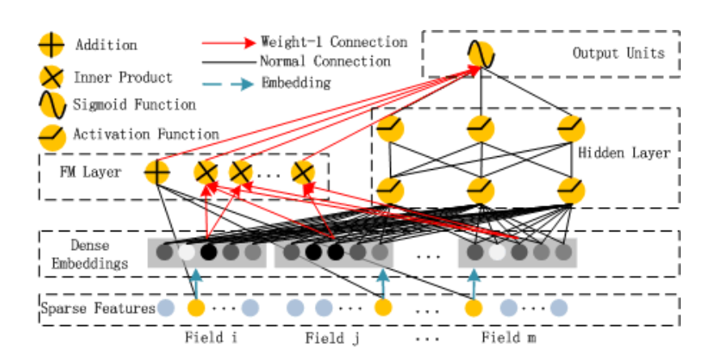
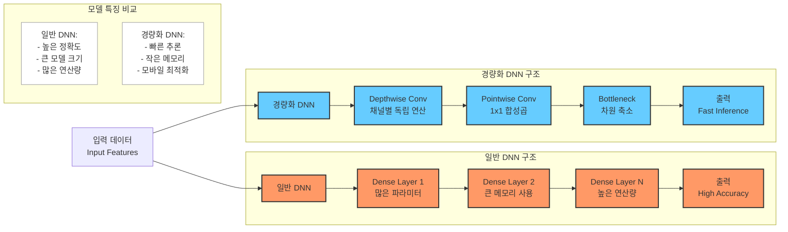
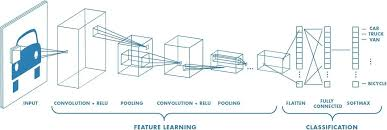
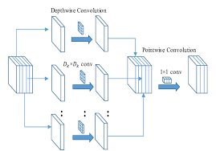
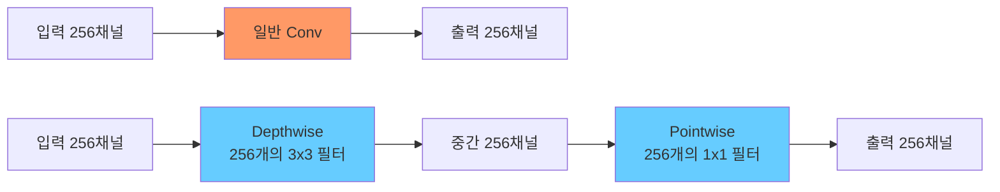

## 주제
- 추천 시스템 접목 실제 예시 (Youtube 이외): 음악 스트리밍 서비스 추천 시스템 심층 분석 및 비교 (Apple Music, Spotify, etc.)
- 이번 주 교재 내용 딥다이브: 심층 신경망(DNN) 기반 추천 시스템 모델 심층 분석
- (선택) 경량화 DNN (발제 내용) 코드 이해 및 적용 방안 연구

## 내용

### 1. 추천 시스템 접목 실제 예시: 음악 스트리밍 서비스 추천 시스템 심층 분석 및 비교
를 하기 전에 제가 전에 궁금해서 조사했던 카카오뮤직 추천시스 템관련 글이
https://realalpaca01.tistory.com/entry/%EC%8A%A4%ED%8A%B8%EB%A6%AC%EB%B0%8D-%EC%84%9C%EB%B9%84%EC%8A%A4-%EB%A9%94%EB%9A%9C%EA%B8%B0%EC%9D%98-%EC%B6%94%EC%B2%9C%EC%8B%9C%EC%8A%A4%ED%85%9C-%EB%B9%84%EA%B5%90%EC%A3%BC%EA%B4%80%EC%A0%81?category=1216250
이것도 봐주시라요...


#### 1.1. 음악 스트리밍 서비스 추천 시스템 개요

음악 스트리밍 서비스는 사용자에게 개인화된 음악 추천을 제공하기 위해 다양한 추천 알고리즘을 사용합니다. 각 서비스는 고유한 데이터와 알고리즘을 활용하여 사용자 만족도를 높이고 있습니다. 이번 섹션에서는 Apple Music, Spotify, YouTube Music을 비교 분석합니다.

#### 1.2. 음악 스트리밍 서비스별 추천 시스템 비교

| 서비스      | 주요 추천 알고리즘                               | 특징                                                                                                                                  | 장점                                                                                                                                     | 단점                                                                                                                            |
| ----------- | ------------------------------------------------- | ------------------------------------------------------------------------------------------------------------------------------------- | ---------------------------------------------------------------------------------------------------------------------------------------- | ------------------------------------------------------------------------------------------------------------------------------- |
| Apple Music | 협업 필터링, 콘텐츠 기반 필터링, 딥러닝 기반 모델 | 전문가 큐레이션, 사용자 취향 분석, Apple 생태계 연동                                                                                    | 높은 음질, 큐레이션 기능, 오프라인 재생                                                                                                  | 개인화 추천 정확도 편차, 폐쇄적인 생태계                                                                                       |
| Spotify     | 협업 필터링, 자연어 처리, 딥러닝 기반 모델         | Discover Weekly, Release Radar, 사용자 플레이리스트 분석                                                                                | 개인화 추천 강점, 다양한 장르 지원, 소셜 기능                                                                                            | 음질 상대적 열세, 팟캐스트 광고                                                                                              |
| YouTube Music | 딥러닝 기반 모델, 콘텐츠 기반 필터링               | YouTube 데이터 활용, 사용자의 시청 기록 분석, 음악 외 다양한 콘텐츠 추천                                                                 | 방대한 음원 라이브러리, 뮤직비디오 지원, 다른 Google 서비스 연동                                                                         | 개인화 추천 정확도 개선 필요, 광고                                                                                              |

#### 1.3. 기술적 분석

##### 1.3.1. 협업 필터링 (Collaborative Filtering)

**정의:** 사용자-아이템 상호작용 패턴을 기반으로 추천을 제공하는 방법. 유사한 사용자의 행동을 분석하거나 유사한 아이템을 찾아 추천합니다.

**수식:**

*   사용자 기반 협업 필터링:

    ```
    similarity(u, v) = Σ(i ∈ Iuv) rui * rvi / (sqrt(Σ(i ∈ Iu) rui^2) * sqrt(Σ(i ∈ Iv) rvi^2))
    prediction(u, i) = Σ(v ∈ Nu) similarity(u, v) * rvi / Σ(v ∈ Nu) |similarity(u, v)|
    ```

    여기서,

    *   `u`, `v`: 사용자
    *   `i`: 아이템
    *   `rui`: 사용자 `u`가 아이템 `i`에 준 평점
    *   `Iuv`: 사용자 `u`와 `v`가 모두 평가한 아이템 집합
    *   `Nu`: 사용자 `u`와 유사한 사용자 집합

*   아이템 기반 협업 필터링:

    ```
    similarity(i, j) = Σ(u ∈ Uij) rui * ruj / (sqrt(Σ(u ∈ Ui) rui^2) * sqrt(Σ(u ∈ Uj) ruj^2))
    prediction(u, i) = Σ(j ∈ Ni) similarity(i, j) * ruj / Σ(j ∈ Ni) |similarity(i, j)|
    ```

    여기서,

    *   `i`, `j`: 아이템
    *   `u`: 사용자
    *   `Uij`: 아이템 `i`와 `j`를 모두 평가한 사용자 집합
    *   `Ni`: 아이템 `i`와 유사한 아이템 집합

**적용 예시:** Spotify의 Discover Weekly는 협업 필터링을 통해 사용자와 유사한 취향을 가진 다른 사용자들이 즐겨 듣는 음악을 추천합니다.

##### 1.3.2. 콘텐츠 기반 필터링 (Content-Based Filtering)

**정의:** 아이템의 메타데이터(장르, 아티스트, 가사 등)를 분석하여 사용자가 선호할 만한 아이템을 추천하는 방법.

**수식:**

*   아이템 프로필 생성:

    ```
    profile(i) = Σ(f ∈ Fi) wif * feature(f)
    ```

    여기서,

    *   `i`: 아이템
    *   `Fi`: 아이템 `i`의 특징 집합
    *   `wif`: 특징 `f`의 가중치
    *   `feature(f)`: 특징 `f`의 값

*   사용자 프로필 생성:

    ```
    profile(u) = Σ(i ∈ Iu) rui * profile(i) / Σ(i ∈ Iu) rui
    ```

    여기서,

    *   `u`: 사용자
    *   `Iu`: 사용자 `u`가 평가한 아이템 집합
    *   `rui`: 사용자 `u`가 아이템 `i`에 준 평점

*   추천 점수 계산:

    ```
    score(u, i) = cosine_similarity(profile(u), profile(i))
    ```

**적용 예시:** Apple Music은 콘텐츠 기반 필터링을 통해 사용자가 이전에 들었던 음악과 유사한 장르나 아티스트의 음악을 추천합니다.

##### 1.3.3. 딥러닝 기반 모델 (Deep Learning-Based Models)

**정의:** 심층 신경망을 사용하여 사용자-아이템 간의 복잡한 관계를 모델링하고 추천을 제공하는 방법.

**모델 종류:**

*   **NeuMF (Neural Matrix Factorization):** 행렬 분해와 신경망을 결합하여 사용자-아이템 간의 잠재적 상호작용 학습.

*   **DeepFM (Deep Factorization Machine):** Factorization Machine (FM)과 심층 신경망을 결합하여 특징 간의 상호작용 모델링.

   

**수식:**
*   NeuMF:

    ```
    prediction(u, i) = σ(h^T * φ(pu, qi))
    ```

    여기서,

    *   `pu`: 사용자 `u`의 임베딩 벡터
    *   `qi`: 아이템 `i`의 임베딩 벡터
    *   `φ`: 신경망 모델
    *   `h`: 출력 가중치 벡터
    *   `σ`: 시그모이드 함수

**적용 예시:** YouTube Music은 딥러닝 기반 모델을 사용하여 사용자의 시청 기록과 검색 기록을 분석하고, 개인화된 음악 추천을 제공합니다.

#### 1.4. 음악 스트리밍 서비스 추천 시스템의 한계 및 개선 방향

*   **데이터 희소성 문제:** 사용자의 평가나 청취 기록이 부족할 경우 추천 정확도가 낮아지는 문제.
    *   **개선 방향:** 콜드 스타트 문제 해결을 위해 콘텐츠 메타데이터 활용, 사용자 초기 행동 패턴 분석, 능동적 피드백 유도.
*   **다양성 부족 문제:** 사용자의 기존 선호에 치우친 추천으로 새로운 음악 발견 기회 감소.
    *   **개선 방향:** 탐색-활용 균형 알고리즘 적용, 음악 다양성 확보, 실험적 추천 도입.
*   **설명 가능성 부족 문제:** 추천 이유에 대한 명확한 설명 부재로 사용자의 신뢰도 하락.
    *   **개선 방향:** 추천 이유 시각화, 사용자 피드백 반영, 투명성 강화.

#### 1.5. 머메이드 다이어그램

```
graph LR
    A[사용자] --> B(데이터 수집);
    B --> C{데이터 분석};
    C --> D[추천 알고리즘];
    D --> E{개인화된 음악 추천};
    E --> F[사용자 피드백];
    F --> B;
```

### 2. 심층 신경망(DNN) 기반 추천 시스템 모델 심층 분석

#### 2.1. DNN 기반 추천 시스템 개요

DNN 기반 추천 시스템은 기존 추천 시스템의 한계를 극복하고, 다양한 형태의 데이터를 통합적으로 활용하여 추천 정확도를 향상시키는 모델입니다. 특히, 사용자-아이템 간의 복잡한 비선형 관계를 모델링하는 데 강점을 가집니다.

#### 2.2. DNN과 경량화 DNN의 구조 비교



##### 2.2.1. 구조별 특징

###### 일반 DNN
- **구조**: 전통적인 Dense Layer(완전 연결 계층)로 구성되며, 각 층에서 모든 입력 노드와 출력 노드가 연결됨
- **장점**: 높은 표현력과 성능
- **단점**: 모바일 환경이나 임베디드 장치에서 실행하기 어려움

###### 경량화 DNN
- **구조**: Depthwise Convolution, Pointwise Convolution, Bottleneck Layer 등을 활용한 효율적 구조
- **장점**: 빠른 추론 속도와 낮은 메모리 요구사항
- **단점**: 일반 DNN에 비해 성능이 약간 저하될 수 있음

##### 2.2.2. 연산량 비교

###### 일반 Convolution
- 파라미터 수: $K \times K \times C_{in} \times C_{out}$
- 연산량: $K \times K \times C_{in} \times C_{out} \times H \times W$

###### Depthwise Separable Convolution
- Depthwise Convolution:
  - 파라미터 수: $K \times K \times C_{in}$
  - 연산량: $K \times K \times C_{in} \times H \times W$
- Pointwise Convolution:
  - 파라미터 수: $C_{in} \times C_{out}$
  - 연산량: $C_{in} \times C_{out} \times H \times W$

#### 2.3. 주요 모델 구조

- **손실 함수:**
    - 이진 교차 엔트로피 (Binary Cross-Entropy): 클릭 여부 예측
    - 평균 제곱 오차 (Mean Squared Error): 평점 예측
- **최적화 알고리즘:**
    - Adam, SGD 등
- **정규화 기법:**
    - 드롭아웃 (Dropout), 배치 정규화 (Batch Normalization)

#### 2.4. DNN 기반 추천 시스템의 장단점

- **장점:**
    - 높은 추천 정확도
    - 다양한 형태의 데이터 통합 가능
    - 복잡한 비선형 관계 모델링 가능
- **단점:**
    - 모델 복잡성으로 인한 학습 시간 증가
    - 과적합 가능성
    - 모델 해석의 어려움

### 3. 경량화 DNN 코드 이해 및 적용 방안 연구

#### 3.1. 경량화 DNN 개요

경량화 DNN은 모델 크기를 줄이고 연산량을 감소시켜, 모바일 기기나 임베디드 시스템과 같은 제한된 환경에서 DNN 모델을 효율적으로 실행할 수 있도록 하는 기술입니다.

#### 3.2. 주요 기법

- **모델 압축 (Model Compression):**
    - 가지치기 (Pruning): 중요도가 낮은 가중치를 제거하여 모델 크기 축소
    - 양자화 (Quantization): 가중치 및 활성화를 저정밀도로 표현하여 메모리 사용량 감소
    - 지식 증류 (Knowledge Distillation): 큰 모델의 지식을 작은 모델로 전달하여 성능 유지
- **효율적인 네트워크 구조 설계 (Efficient Network Architecture Design):**
    - MobileNet, ShuffleNet 등 경량화된 구조를 사용하여 연산량 감소
    - **MobileNet:** Depthwise Separable Convolution을 사용하여 연산량 감소
    - **ShuffleNet:** Channel Shuffle 연산을 사용하여 정보 흐름 개선

#### 3.3. 코드 이해 및 적용 방안

- **PyTorch를 사용한 경량화 DNN 구현:**
    ```
    import torch
    import torch.nn as nn

    class MobileNetV1(nn.Module):
        def __init__(self, num_classes=1000):
            super(MobileNetV1, self).__init__()
            # MobileNetV1 구조 정의
            self.features = nn.Sequential(
                # ... (MobileNetV1 레이어 정의)
            )
            self.classifier = nn.Linear(1024, num_classes)

        def forward(self, x):
            x = self.features(x)
            x = nn.functional.avg_pool2d(x, 7)
            x = x.view(x.size(0), -1)
            x = self.classifier(x)
            return x
    ```
- **적용 방안:**
    - 추천 시스템에 적용하기 위해 MobileNet과 같은 경량화 모델을 사용하여 사용자 및 아이템 임베딩을 학습
    - 지식 증류 기법을 활용하여 복잡한 추천 모델의 지식을 경량화 모델로 전달
    - 모바일 환경에서 실시간 추천을 제공하기 위해 모델 최적화


좋은 질문입니다! 겉보기에는 Depthwise와 Pointwise 두 단계로 나누어져서 더 많은 계산이 필요해 보이지만, 실제로는 큰 폭의 계산량 감소가 있습니다. 구체적인 수치로 비교해보겠습니다:

### ✏️ 지난 논의 사항 | 계산량 비교 예시

일반적인 Convolution과 Depthwise Separable Convolution을 비교해봅시다.

- 입력 채널(C_in) = 256
- 출력 채널(C_out) = 256
- 커널 크기(K) = 3x3
- 특징맵 크기(H x W) = 32x32

#### 1. 일반 Convolution

- 계산량 = $K \times K \times C_{in} \times C_{out} \times H \times W$
- 대입: 3 × 3 × 256 × 256 × 32 × 32
- = 603,979,776 operations

#### 2. Depthwise Separable Convolution

1) Depthwise: $K \times K \times C_{in} \times H \times W$
   - 3 × 3 × 256 × 32 × 32 = 2,359,296 operations

2) Pointwise: $C_{in} \times C_{out} \times H \times W$
   - 256 × 256 × 32 × 32 = 67,108,864 operations

**총 연산량** = 2,359,296 + 67,108,864 = 69,468,160 operations

### 비교 결과
- 일반 Convolution: 603,979,776 operations
- Depthwise Separable Conv: 69,468,160 operations
- **약 8.7배 감소!**

### 왜 감소하는가?

1. **연산 분리의 효과**
   - 일반 Convolution: 공간(K×K)과 채널(C_in×C_out) 정보를 동시에 처리
   - Depthwise Separable: 공간 정보(Depthwise)와 채널 정보(Pointwise)를 분리해서 처리
   - 이 분리로 인해 곱셈의 차수가 줄어듦

2. **수식으로 보는 감소율**
   일반 Conv 대비 Depthwise Separable Conv의 연산량 비율:
   ```
   (K × K × C_in × H × W) + (C_in × C_out × H × W)
   ───────────────────────────────────────────────────
   (K × K × C_in × C_out × H × W)
   
   = 1/C_out + 1/K²
   ```
   - 예시에서는 1/256 + 1/9 ≈ 0.115 (약 8.7배 감소)

3. **시각화**



## 참고 자료
*   Carlos A. Gomez-Uribe and Neil Hunt. 2016. The Netflix Recommender System: Algorithms, Business Value, and Innovation. ACM Trans. Manage. Inf. Syst. 6, 4, Article 13 (January 2016), 19 pages. [https://doi.org/10.1145/2843948](https://doi.org/10.1145/2843948)
*   Apple Music 추천 시스템 분석: [https://www.apple.com/](https://www.apple.com/)
*   Spotify 추천 시스템 분석: [https://www.spotify.com/](https://www.spotify.com/)
*   YouTube Music 추천 시스템 분석: [https://music.youtube.com/](https://music.youtube.com/)

* NeuMF [https://wikidocs.net/178608](https://wikidocs.net/178608)
* DeepFM [https://supkoon.tistory.com/33](https://supkoon.tistory.com/33)
- [딥러닝 모델 경량화 기술 분석](https://repository.kisti.re.kr/bitstream/10580/15591/1/%28%EA%B8%B0%EC%88%A0%29%EB%94%A5%EB%9F%AC%EB%8B%9D%20%EB%AA%A8%EB%8D%B8%20%EA%B2%BD%EB%9F%89%ED%99%94%20%EA%B8%B0%EC%88%A0%20%EB%B6%84%EC%84%9D.pdf)
- [Deep Neural Network 경량화](https://velog.io/@juyeon048/%EB%94%A5-%EB%9F%AC%EB%8B%9D-Deep-Neural-Network-%EA%B2%BD%EB%9F%89%ED%99%94)
- [딥러닝 경량화 튜토리얼](https://ysbsb.github.io/model_compression/2021/10/15/model-compression-guide.html)
