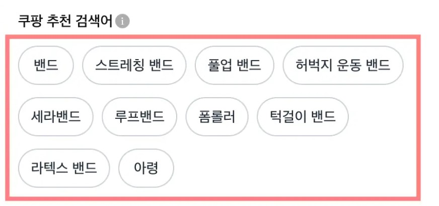

## 주제
<!-- 이번 주차에 다룬 주요 주제를 작성해주세요 -->
4장 및 5장에서 추천시스템 관련해서 전반적인 모델의 구성과 작동 방식을 배웠다. 그 중에서 중요하다고 생각되는 일부 개념과, 실질적으로 추천시스템이 사용되고 있는 예시를 리뷰해보려고 한다.

## 내용
<!-- 주요 개념과 내용을 정리해주세요 -->

### 네거티브 샘플링
- 설명: 추천 시스템에서 모델을 학습할 때 부정적인 예시를 선택적으로 포함하여 학습하는 기법. 이는 사용자가 적극적인 행동을 한 일부 아이템에 대해서만 데이터를 남기지만 추천 시스템은 모든 아이템에 대해 학습해야 하므로 사용자가 선택하지 않은 아이템도 고려해야 함. 하지만 전체 테이터를 고려하여 학습하는 것은 비효율적이기 때문에 negative sample을 선택해 학습 속도를 높임. 또한 implicit feedback은 사용자의 행동 데이터를 기반으로 평가되어 부정적인 피드백이 직접 제공되지 않기 때문에 네거티브 샘플링이 필요.

- 예시: 랜덤 샘플링 : 사용자가 선택하지 않은 아이템 중에서 랜덤하게 샘플해서 사용.
popular 기반 샘플링 : 인기 있는 아이템을 중심으로 샘플해서 사용.
하드 네거티브 샘플링 : 사용자가 관심을 가질 가능성(임베딩 거리 기반, 유사도 기반 등)을 샘플링.
모델 기반 샘플링 : 강화학습, GAN등 활용해 선택.

### 쿠팡 추천 시스템
- 설명: 쿠팡 추천 시스템은 추천을 통해 고객 검색 경험을 고도화하는 전략을 취함. 이는 다음과 같이 검색창에 온 고객에게 최근 검색어에 맞춘 추천 검색어를 노출함으로써 기존 검색 키워드와 유사하거나 더 구체적인 키워드를 통해 지속적으로 상품을 검색하도록 유도함.
이는 두 가지 방식으로 구별되는데,
1. 실제로 고객이 연속해서 검색한 기록을 바탕으로 ‘동시 발생 행렬(Co-occurrence matrix)’을 학습하는 방식. 동시 발생 행렬이란 두 가지 검색 X, Y를 연속해서 검색할 확률을 나타내는 방법으로 고객이 검색한 검색어와 함께 검색될 확률이 높은 순서대로 다른 검색어를 추천하는 방식.
2. 키워드 간의 관계를 지식 그래프 형태로 나타내 인접 키워드를 추천하는 방식. 지식 그래프에서는 간선 1개로 이어진 관계, 또는 2개로 이어진 관계를 통해 이를 추천함.

## 참고 문헌
<!-- 참고한 자료의 제목과 링크를 작성해주세요 -->
이커머스ai추천더잘할수는없을까?
https://blog.blux.ai/%EC%9D%B4%EC%BB%A4%EB%A8%B8%EC%8A%A4-ai-%EC%B6%94%EC%B2%9C-%EB%8D%94-%EC%9E%98%ED%95%A0-%EC%88%98%EB%8A%94-%EC%97%86%EC%9D%84%EA%B9%8C-2-19738

