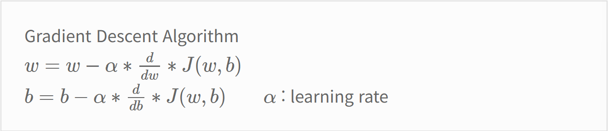
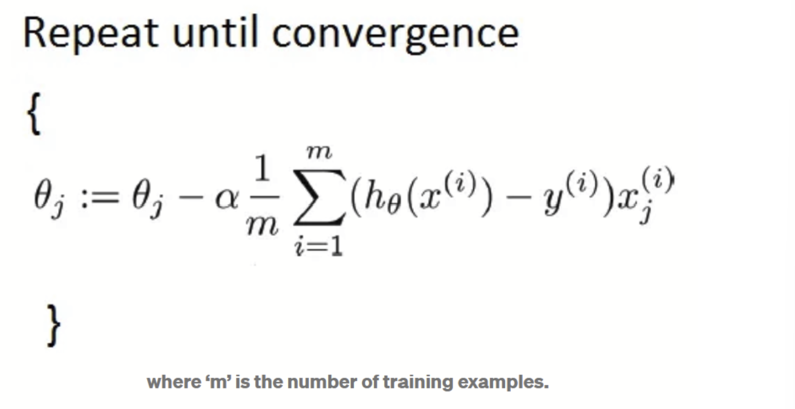
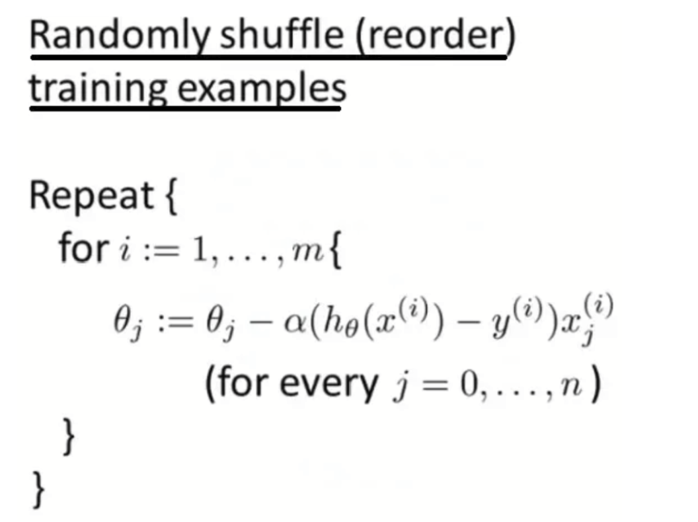
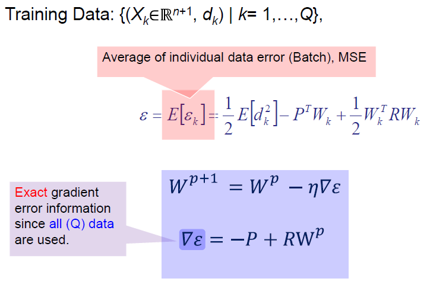
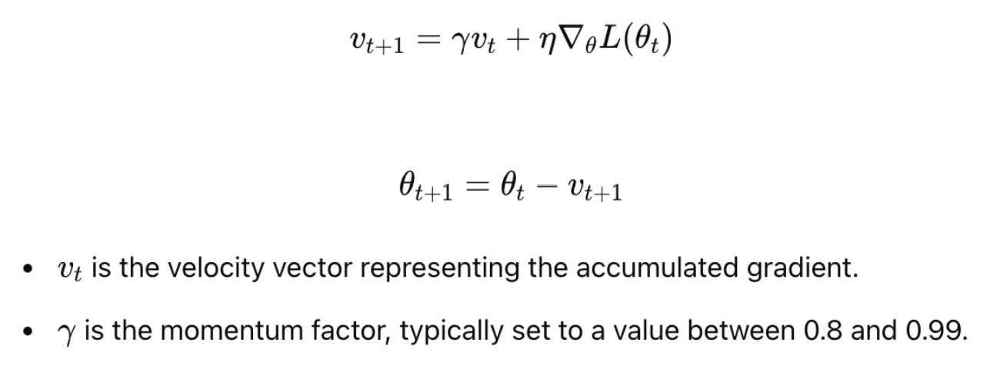
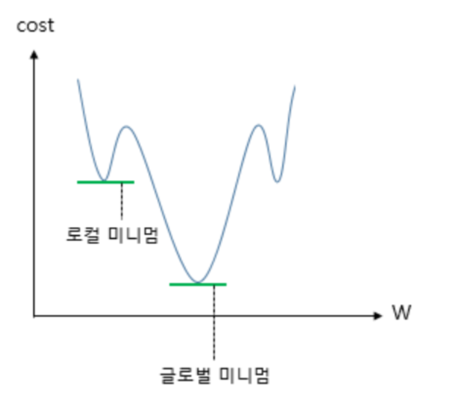
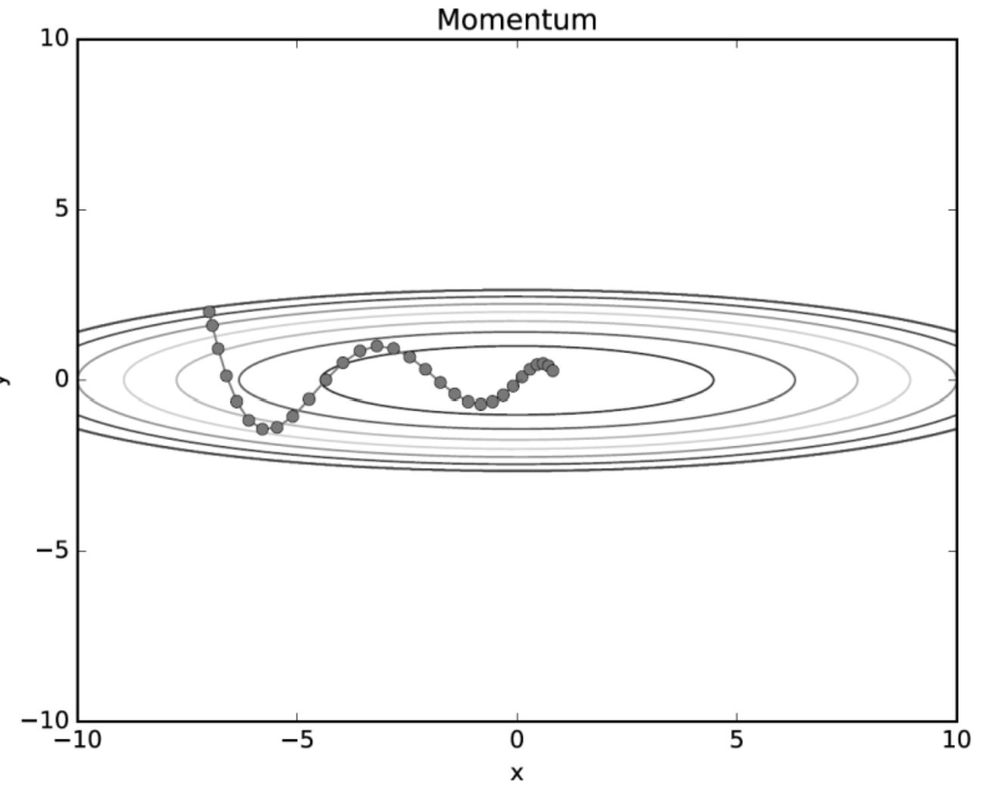
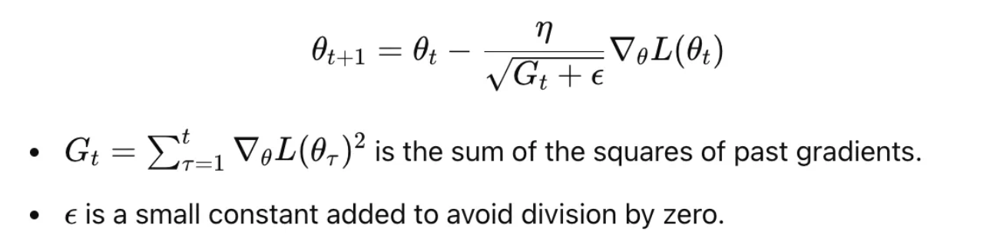
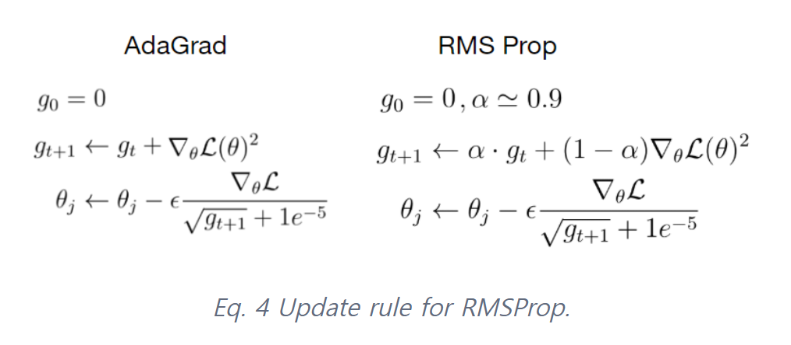
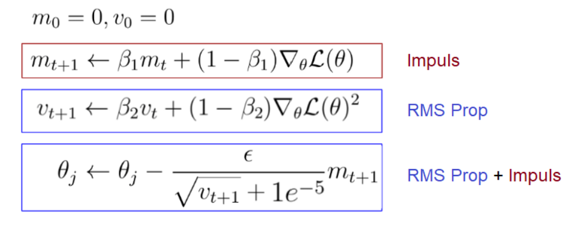

## 주제
<!-- 이번 주차에 다룬 주요 주제를 작성해주세요 -->
- 머신러닝과 딥러닝의 정확한 개념과 차이
- Q) 딥러닝이 항상 머신러닝보다 좋은가?
- 경사하강밥의 다양한 최적화 방법들과 이들의 차이점
- Q) adam이 많이 쓰이는 이유는?

## 내용
<!-- 주요 개념과 내용을 정리해주세요 -->

### 1. 머신러닝 vs 딥러닝
- **머신러닝**의 정의: 데이터를 분석하고, 데이터로부터 학습한 다음, 학습한 것을 적용해 정보에 입각한 결정을 내리는 알고리즘을 포함하는 인공 지능의 애플리케이션

- **딥러닝**의 정의: 알고리즘을 계층으로 구성하여 자체적으로 배우고 똑똑한 결정을 내릴 수 있는 '인공 신경망'을 만드는 머신 러닝의 하위분야

*출처: https://www.zendesk.kr/blog/machine-learning-and-deep-learning/

### 2. 딥러닝

a. **퍼셉트론 (Perceptron)**: 초기의 인공 신경망

실제 뇌를 구성하는 신경 세포 뉴런의 동작과 유사하여, 다수의 입력부터 하나의 결과를 내보내는 알고리즘. 

각각의 입력값에는 각각의 가중치가 존재하는데, 이때 가중치의 값이 크면 클수록 해당 입력 값이 중요하다는 것을 의미한다. 각 입력값이 가중치와 곱해져서 인공 뉴런에 보내지고, 각 입력값과 그에 해당되는 가중치의 곱의 전체 합이 임계치(threshold)를 넘으면 종착지에 있는 인공 뉴런은 출력 신호로서 1을 출력하고, 그렇지 않을 경우에는 0을 출력한다 (Step function).

- 단층 퍼셉트론: 입력층, 출력층 두 단계로만 이루어짐
- 다층 퍼셉트론: 단층 퍼셉트론의 한계를 개선하기 위해 등장. 입력층, 은닉층, 출력층으로 이루어짐 

b. 다층 퍼셉트론 (MLP)

- DNN(Deep Neural Network, 심층 신경): 은닉층이 2개 이상인 신경망

c. 딥러닝의 특징
- 각 노드 또는 은닉층에는 출력과의 관계 강도를 나타내는 가중치가 부여되며, 모델이 학습하면서 이 가중치는 지속적으로 조정된다.
- 딥러닝 기술은 은닉층 구조를 통해 범주를 점진적으로 학습한다.
먼저 문자와 같은 낮은 수준의 범주를 학습한 후, 단어와 문장처럼 점차 높은 수준의 범주를 정의한다.
이러한 '데이터에서 고수준 특징을 점진적으로 학습하는 방식'은 별도의 도메인 전문 지식이나 복잡한 특징 추출 과정 없이도 효과적인 학습이 가능하도록 하며, 기존 머신러닝 방법과의 큰 차이점이라 할 수 있다.
- 딥러닝의 큰 장점은 방대한 양의 데이터로 학습할 수 있다는 점이다.
딥러닝 모델을 스포츠카에 비유하듯, 일정 거리 이상 가속해야 최고 속도에 도달할 수 있다.
마찬가지로, 충분한 데이터가 없으면 성능을 제대로 발휘하지 못하며, 데이터가 부족한 환경에서는 오히려 단순한 모델이 더 효과적일 수 있다.
이는 울창한 숲길에서는 페라리(예: 합성곱 신경망)보다 산악자전거(예: CART 결정 트리)가 더 적합한 것과 같은 원리다.
- 딥러닝은 전통적인 머신러닝 알고리즘과 달리 고성능 머신이 필요하며, 현재 딥러닝 알고리즘을 실행하는 데 GPU는 필수적인 요소이다.
  

*출처: https://medium.com/towards-data-science/why-deep-learning-is-needed-over-traditional-machine-learning-1b6a99177063

### 3. 딥러닝이 무조건 머신러닝보다 좋은 성능 결과를 내는가?

그렇지 않다. 주로 딥러닝은 다음과 같은 상황에 선호된다:
1. 데이터가 방대할 경우 딥러닝이 다른 기법보다 우수한 성능을 발휘하지만, 데이터가 적을 때는 전통적인 머신러닝 알고리즘이 더 적합하다.
2. 딥러닝 기법은 합리적인 학습 시간을 확보하기 위해 고성능 인프라가 갖춰져야 한다.
3. 특징 추출에 대한 도메인 지식이 부족할 경우, 딥러닝은 별도의 특징 엔지니어링에 대한 고민 없이도 강력한 성능을 발휘할 수 있기 때문에 머신러닝보다 더 적합하다다.

### 4. 경사하강법(gradient descent method)이란?

최적화 알고리즘은 머신러닝에서 모델이 손실 함수를 최소화하도록 가중치를 조정하며 학습하는 데 중요한 역할을 한다. 
이들 중 가장 많이 사용되는 경사하강법은 손실 함수의 기울기를 활용하여 오차를 최소화하도록 매개변수를 갱신하며 1차 근삿값을 찾는다.
- 기본 개념: 함수의 기울기(경사)를 구하고 경사의 반대 방향으로 계속 이동시켜 극값(기울기=0)에 이를 때까지 반복시킴
- 경사하강법은 하나의 반복 안에서 다룰 데이터 세트의 크기에 따라 세 종류로 나뉜다.
  

### 5. 경사하강법의 세 종류 (BGD, SGD, MGD)
a. **Batch Gradient Descent Method (배치 경사 하강법)**

- *batch: 가중치 등의 매개 변수의 값을 조정하기 위해 사용하는 데이터의 양 -> 전체 데이터 or 정해준 양의 데이터를 가지고 매개변수의 값 조정 가능
- 일반적인 경사하강법
- 각 반복마다 모든 훈련 데이터 세트를 처리하는 방법
- 1 iteration 안에서 전체 데이터 샘플의 기울기를 계산
- 기울기 계산 후 모든 매개변수에 대한 업데이트를 진행한 후 다시 최적의 해에 도달할 때까지 모든 데이터를 가지고 같은 계산 반복
- 수렴하는 데 오랜 시간이 걸린다는 단점이 존재한다.

b. **Stochastic Gradient Descent (확률적 경사 하강법)**

- 매개변수 값을 조정 시 랜덤으로 선택한 하나의 데이터에 대해서만 계산하는 방법
- 가장 먼저 전체 훈련 데이터 세트를 무작위화
- 그 다음, 하나의 iteration 안에서 하나의 데이터에 대해서만 손실함수에 대한 기울기를 계산해서 업데이트 진행
- 첫 매개변수 업데이트 -> 다음 매개변수 업데이트 ... -> m번째 데이터 기울기 계산 후 업데이트
- 최적의 매개변수 값에 도달할 때까지 해당 계산을 반복
- 적은 데이터를 사용하므로 BGD보다 계산이 빠르다.
- 최솟값인 (0,0)까지 지그재그로 이동하므로 비효율적이라는 단점이 존재한다. (parameter 변경 폭이 불안정하다)
- SGD의 단점을 개선해주는 방법으로는 Momentum, Adagrad, Adam의 세 가지 방법이 있다.
  
[SGD.png]

c. **Mini Batch Gradient Descent (미니배치 경사 하강법)**

- 전체 데이터셋을 mini-batch 여러 개로 나눈 뒤, 미니 배치 한 개마다 기울기를 구한다. 이때 평균 기울기를 이용하여 모델을 업데이트해서 학습하는 방법
- 전체 데이터를 계산하는 것보다 빠르다.
- 변경 폭이 SGD에 비해 안정적이고 속도도 빠르다.

d. **SGD with momentum**

- 경사 하강법에 관성을 더해줌
- **momentum**: SGD에서 계산된 접선의 기울기에 1 step 전의 접선의 기울기값을 일정한 비율만큼 반영
- 이러한 momentum의 방식을 적용하면, 마치 언덕에서 공이 내려올 때, 중간에 작은 웅덩이에 빠지더라도 관성의 힘으로 넘어서는 효과를 줄 수 있다.
- local minimum에 도달했을 때, 관성의 힘을 빌려 값을 조절하여 로컬 미니멈에서 탈출 -> 기존의 경사 하강법이라면 로컬 미니멈을 글로벌 미니멈으로 잘못 인식했을 것! 

#### 정리

### 6. 다양한 최적화 방법들
a. **AdaGrad**

- *학습률 감소 (learning rate decay): 학습률을 적절하게 설정하기 위해 사용하는 기술; 학습 진행 중에 learning rate을 줄여가는 방법 (처음에 크게 학습 -> 점차 작게 학습)
- 기울기의 크기에 따라 learning rate를 자동으로 조정하는 최적화 알고리즘.
  매 학습 단계에서 각 매개변수(가중치)에 대한 기울기의 제곱을 누적해서 기록하는 방식으로 동작한다.
- 변화가 적은 방향 (기울기가 작은 방향)에서는 학습 속도를 높이는 효과
- 변화가 급격한 방향 (기울기가 큰 방향)에서는 학습 속도를 줄이는 효과
- 특정 가중치를 업데이트할 때, 현재 기울기를 이전까지의 기울기 제곱합의 제곱근으로 나눈다
- 수식에서 보이는대로, g의 루트 로 나누어진 형태로 업데이트 되므로, 작은 기울기를 가장 방향은 상대적으로 큰 값으로 조정되고, 큰 기울기를 가진 방향은 작은 값으로 조정된다.
- 따라서 학습을 안정적으로 진행할 수 있다는 장점이 있다.
- 그러나 시간이 지남에 따라 기울기 제곱의 누적 합이 커지면, 학습률이 점차 줄어들어 0에 수렵해 학습이 멈출 수도 있다는 단점이 있다. -> 이를 보완한게 RMSProp

b. **RMSProp**

- *지수이동평균: 과거의 기울기들을 똑같이 더해가는 것이 아닌, 먼 과거의 기울기는 조금 반영하고 최신의 기울기를 많이 반영
- 기울기 제곱의 누적값이 계속 증가하지 않도록 일정 비율로 감소시키는 방식을 사용하는 (AdaGrad의 단점을 개선한) 최적화 알고리즘
- 기울기가 작은 방향에서는 학습률이 상대적으로 커져 업데이트가 활발하게 진행됨
- 기울기가 큰 방향에서는 학습률이 줄어들어 안정적인 학습이 가능함
- AdaGrad의 장점은 가져가면서 단점을 보완!

b. **Adam (아담)**

- SGD momentum (기울기의 이동평균;momentum 사용하여 속도 조절) 과 RMSProp (기울기 제곱의 누적합을 사용하여 학습률을 적응적으로 조정) 의 장점을 결합한 최적화 알고리즘
- 1) 첫 번째 momentum 계산
     - 과거 기울기 정보를 반영하여 새로운 기울기 평균 m을 계산
     - 베타1 (보통 0.9)는 과거 기울기의 영향을 조절하는 hyperparameter
     - SGD momentum 처럼 기울기 방향을 매끄럽게 만듦
  2) 두 번째 momentum 계산
     - 과거 기울기 제곱의 평균을 계산해서 기울기 크기에 따라 학습률을 조절
     - 베타2 (보통 0.999)는 기울기 크기의 변화량을 조절하는 hyperparameter
     - RMSProp 처럼 학습률을 적응적으로 조절 -> 큰 기울기는 작게, 작은 기울기는 크게
  3) 가중치 업데이트
     - 위에서 구한 두 모멘텀을 이용해서 가중치를 업데이트
- 처음 학습을 시작할 때 m, v가 0으로 초기화되므로 첫 번째 업데이트에서 계산된 값이 매우 작을 수 있음 -> 초반에는 기울기 업데이트가 너무 커져서 학습이 불안정해질 위험 존재
  - 이를 해결하기 위해 bias correction 적용
  - 이는 초기 단계에서 업데이트 크기가 너무 커지는 문제를 방지한다

### 7. 왜 Adam 이 가장 많이 쓰이는가?

보편적으로 간단한 작업을 수행하거나 작은 데이터셋을 다룰 때는, 일반적인 Gradient descent 알고리즘을 사용하는 것이 적합하다고 알려져 있다.
그러나, Neural Network Architecture을 다룰 대는 Adam의 하이퍼파라미터 (𝛽1 = 0.9, 𝛽2 = 0.999, learning rate = 0.001-0.0001)를 설정했을 때,
다양한 경우에서 좋은 성능을 얻었다는 사례가 많아지면서 Adam을 디폴트 알고리즘으로 사용하는 경우가 흔해진 것을 볼 수 있다.

### 참고 자료
- https://medium.com/@ilyurek/optimizers-a-deep-dive-into-gradient-descent-adam-and-beyond-e6a1d00bc9b0
- https://velog.io/@cha-suyeon/DL-%EC%B5%9C%EC%A0%81%ED%99%94-%EC%95%8C%EA%B3%A0%EB%A6%AC%EC%A6%98-RMSProp-Adam
- https://velog.io/@cha-suyeon/DL-%EC%B5%9C%EC%A0%81%ED%99%94-%EC%95%8C%EA%B3%A0%EB%A6%AC%EC%A6%98
- https://m.blog.naver.com/PostView.naver?isHttpsRedirect=true&blogId=lego7407&logNo=221681014509
- https://bruders.tistory.com/91
- https://data-science-hi.tistory.com/165
- https://ko.wikipedia.org/wiki/%EB%94%A5_%EB%9F%AC%EB%8B%9D
- https://www.geeksforgeeks.org/optimization-techniques-for-gradient-descent/
- https://wikidocs.net/60680
- https://artemoppermann.com/optimization-in-deep-learning-adagrad-rmsprop-adam/

